# Realize Integrated Analytical Solutions with Azure Synapse Analytics

- [Realize Integrated Analytical Solutions with Azure Synapse Analytics](#realize-integrated-analytical-solutions-with-azure-synapse-analytics)
  - [About Azure Synapse Analytics](#about-azure-synapse-analytics)
  - [Surveying the Components of Azure Synapse Analytics](#surveying-the-components-of-azure-synapse-analytics)
  - [Exploring Azure Synapse Studio](#exploring-azure-synapse-studio)
    - [The Data hub](#the-data-hub)
    - [The Develop hub](#the-develop-hub)
    - [The Orchestrate hub](#the-orchestrate-hub)
    - [The Monitor hub](#the-monitor-hub)
    - [The Manage hub](#the-manage-hub)
  - [Designing a Modern Data Warehouse using Azure Synapse Analytics](#designing-a-modern-data-warehouse-using-azure-synapse-analytics)

## About Azure Synapse Analytics

Azure Synapse is an end-to-end analytics platform which combines SQL data warehousing, big data analytics, and data integration into a single integrated environment.

Synapse empowers users to gain quick access and insights across all of their data, enabling a whole new level of performance and scale that is simply unmatched in the industry.

As you will see here in our workspace, Synapse brings all of our data into a single service. Synapse does not just remove the silos between people in the organization, it also brings the data closer together.

*Supplementary Info:*

Azure Synapse Analytics is the evolution of the Azure SQL data warehouse service. With Azure Synapse, we give you a unified service with fully integrated capabilities, not just ETL. We've also enabled hybrid data ingestion and orchestration and secure Self Service Enterprise Analytics. Through our data warehouse we're also providing AI and big data processing built into Synapse. We've added capabilities such as efficient compute for on-demand query processing as well as monitoring, management, and integrated security.

## Surveying the Components of Azure Synapse Analytics

1. Start with the Azure resource group, `synapse-in-a-day-demos`.

    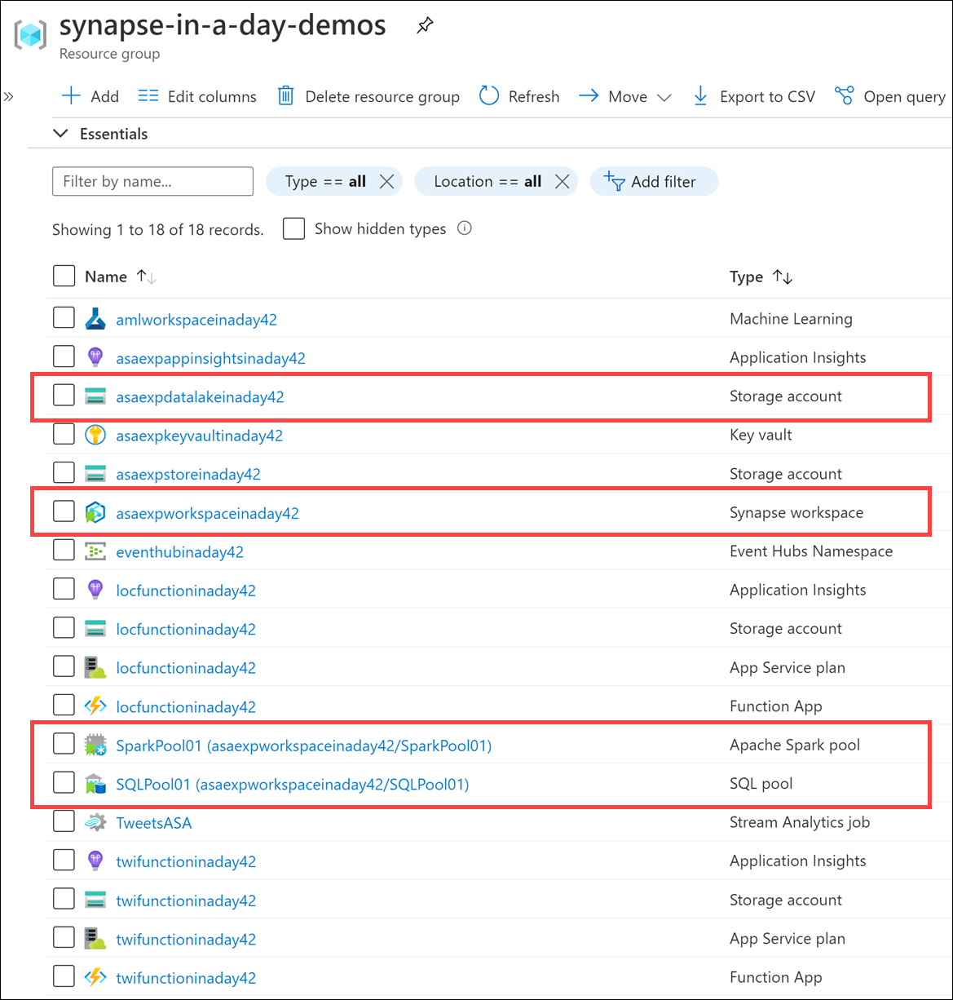

    > The Azure Synapse Analytics components are highlighted in the screenshot above.

    When you deploy Azure Synapse Analytics, there are a few resources that deploy along with it, including the Azure Synapse Workspace and an Azure Data Lake Storage Gen2 (ADLS Gen2) account that acts as the primary storage for the workspace.

    In this example, we have a retail customer that uses Synapse Analytics as the central piece of a modern data warehouse. They ingest data from various sources, cleanse, transform, and analyze the data, train machine learning models, and create various reports. We will show these other related components alongside the Synapse Analytics components as a point of reference, but will focus on Synapse for now.

2. Open the **Synapse workspace**.

    

    The Synapse workspace portal resource contains links to configure your workspace, manage access through Access control (IAM), firewalls, managed identities, and private endpoint connections, and view metrics. It also contains important information about your Synapse Analytics environment, such as:

    1. The **Primary ADLS Gen2 account URL (1)**, which identifies the primary data lake storage account.
    2. The **SQL endpoint** and **SQL on-demand endpoint (2)**, which are used to integrate with external tools, such as SQL Server Management Studio (SSMS), Azure Data Studio, and Power BI.
    3. The **Workspace web URL (3)**, a direct link to Synapse Studio for the workspace.
    4. Available resources, such as **SQL pools** and **Apache Spark pools (4)**.

3. Select the **SQL pool**.

    

    The SQL pool is shown below with the `Essentials` portion of the Overview blade collapsed.

    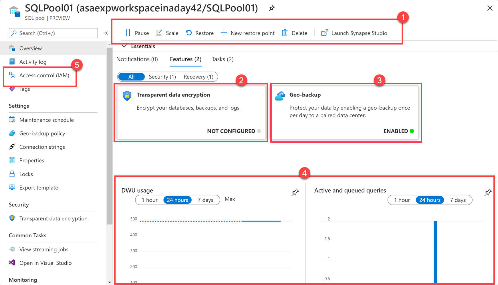

    The SQL pool refers to the enterprise data warehousing features formerly provided by SQL Data Warehouse. It represents a collection of analytic resources that are provisioned when using Synapse SQL, vs. on-demand, provided by SQL serverless. The size of SQL pool is determined by Data Warehousing Units (DWU).

    You can access the SQL pool in the portal, as shown here, or from within Synapse Studio, as we'll show you in a bit. When you access SQL pool in the portal, you have configurations and controls not available to you from Synapse Studio. Here are some of the common features you'll access through the portal:

    1. At the top of the window, we see **controls (1)** to pause, scale, restore, set a new restore point, and delete the pool.
    2. Below, **Transparent data encryption (2)** is prominently displayed, letting us quickly see whether it is enabled to encrypt our databases, backups, and logs.
    3. Next to that, we see the **Geo-backup (3)** option and whether it is enabled to backup once per day to a paired data center.
    4. At the bottom of the Overview blade, we see metrics showing the **Data Warehousing Units (DWU) usage** and **Active and queued queries (4)**, allowing us to filter within different time ranges.
    5. The left-hand menu includes some of these options, as well. It is here where you find the **Access control (IAM) (5)** settings to control access to the SQL pool, granted to users and services.

4. Close the SQL pool and open the **Spark pool**.

    

    The Spark pool is shown below.

    

    Apache Spark is a parallel processing framework that supports in-memory processing to boost the performance of big-data analytic applications. Apache Spark in Azure Synapse Analytics is one of Microsoft's implementations of Apache Spark in the cloud. Azure Synapse makes it easy to create and configure a Spark pool in Azure, which is compatible with Azure Storage and Azure Data Lake Storage Gen2. Apache Spark in Azure Synapse supports workloads for data engineers, data analysts, and data scientists.

    Most of the options we see here are also available from within Synapse Studio, including:

    1. Configuring **auto-pause settings**, based on cluster idle time, and **auto-scale settings (1)** based on the amount of activity.
    2. The **Packages (2)** option allows you to upload an environment configuration file (output from the `pip freeze` command) that defines the Python packages to load on the cluster. The packages listed in this file for install or upgrade are downloaded from PyPi at the time of pool startup. This requirements file is used every time a Spark instance is created from that Spark pool.

    On the left-hand menu, you can also find the **Access control (IAM) (3)** settings to control access to the Spark pool, granted to users and services.

5. Select **Packages** on the left-hand menu of the Spark pool.

    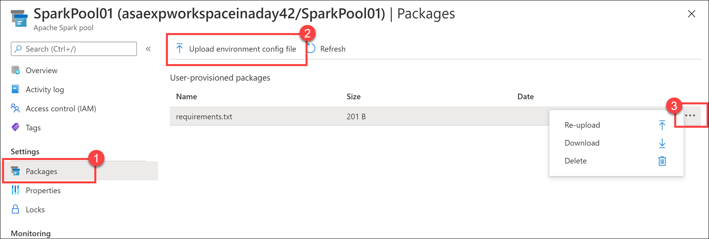

    When you select **Packages (1)** on the left-hand menu, you can view whether a `requirements.txt` file has been added to manage Python packages for Spark instances. You can **upload an environment config file (2)**, or select the ellipses (...) to the **right-hand side of a package file (3)** to access options to re-upload, download, or delete the file.

## Exploring Azure Synapse Studio

1. Open Synapse workspace in the resource group, then select either **Launch Synapse Studio** or the **Workspace web URL**.

    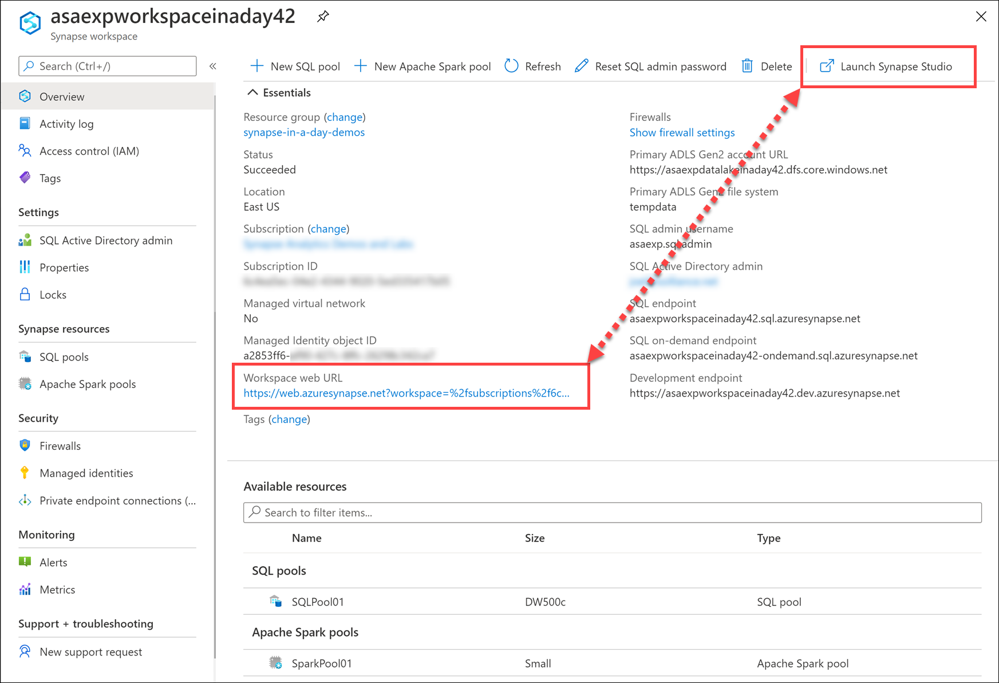

    Synapse Studio is where you manage your workspace, explore data, create data movement pipelines, write T-SQL scripts, create and run Synapse Spark notebooks, build mapping data flows, create reports, and monitor your environment.

    Most of your work will be done here.

### The Data hub

1. Select the **Data** hub.

    

    The Data hub is where you access your provisioned SQL pool databases and SQL serverless databases in your workspace, as well as external data sources, such as storage accounts and other linked services.

2. Under the **Workspace (2)** tab of the Data hub (1), expand the **SQLPool01 (3)** SQL pool underneath **Databases**.

    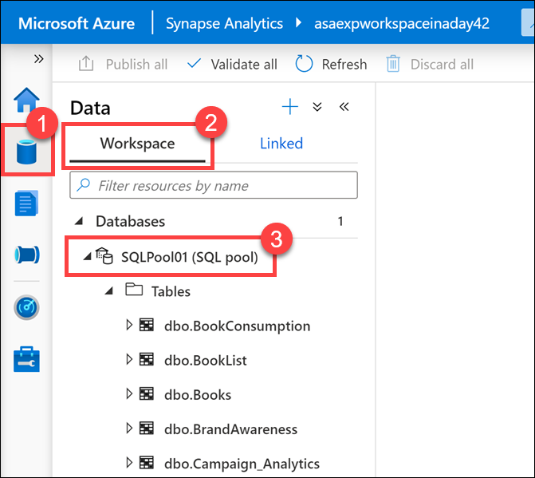

    > **Note**: The SQL pool must be running before you can display its tables.

3. Expand **Tables** and **Programmability/Stored procedures**.

    The **tables** listed under the SQL pool store data from multiple sources, such as SAP Hana, Twitter, Azure SQL Database, and external files copied over from an orchestration pipeline. Synapse Analytics gives us the ability to combine these data sources for analytics and reporting, all in one location.

    You will also see familiar database components, such as **stored procedures**. You can execute the stored procedures using T-SQL scripts, or execute them as part of an orchestration pipeline.

4. Select the **Linked** tab, expand the **Azure Data Lake Storage Gen2** group, then expand the **primary storage** for the workspace.

    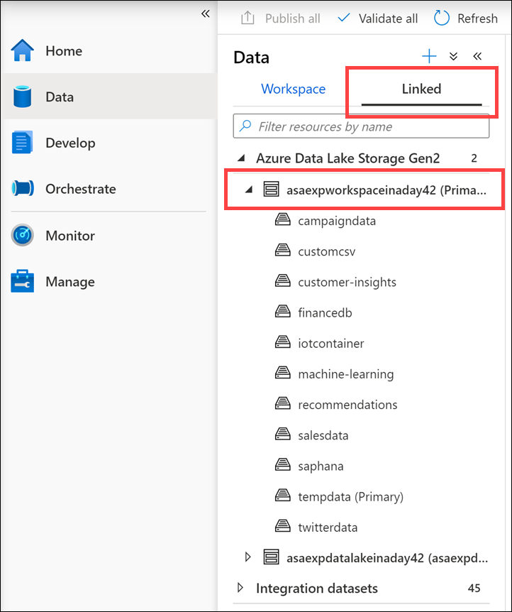

    Every Synapse workspace has a primary ADLS Gen2 account associated with it. This serves as the **data lake**, which is a great place to store flat files, such as files copied over from on-premises data stores, exported data or data copied directly from external services and applications, telemetry data, etc. *Everything is in one place*.

    In our example, we have several containers that hold files and folders that we can explore and use from within our workspace. Here you can see marketing campaign data, CSV files, finance information imported from an external database, machine learning assets, IoT device telemetry, SAP Hana data, and tweets, just to name a few.

    Now that we have all this data in once place, we can start previewing some of it right here, right now.

    Let's look at Campaign data.

5. Select the **customcsv** storage container.

    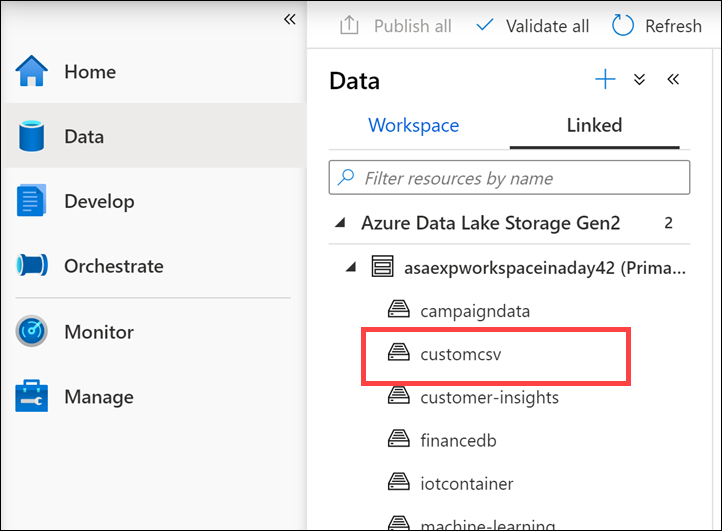

    Let’s preview Campaign data to understand new campaign names.

6. Right-click on the **CampaignAnalyticsLatest.csv** file **(1)**, then select **Preview (2)**.

    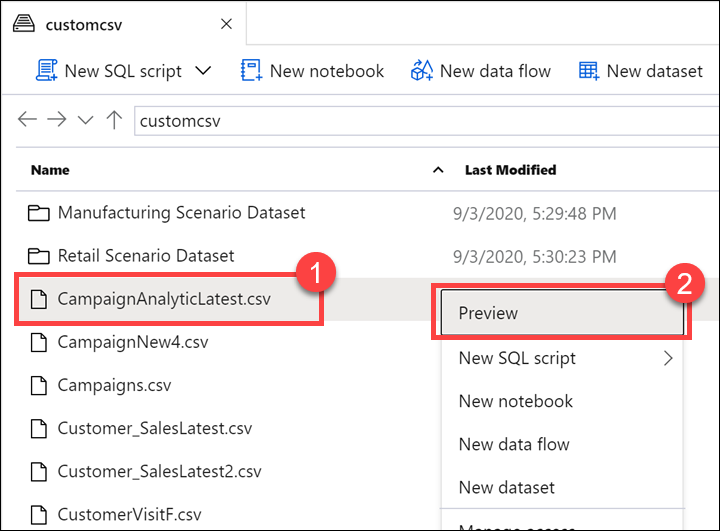

    The file explorer capabilities allow you to quickly find files and perform actions on them, like preview file contents, generate new SQL scripts or notebooks to access the file, create a new data flow or dataset, and manage the file.

    *Notice all the new Campaign names.*

    

### The Develop hub

1. Select the **Develop** hub.

    

    The Develop hub is where you manage SQL scripts, Synapse notebooks, data flows, and Power BI reports.

2. Expand **SQL scripts** and select **1 SQL Query With Synapse (1)**. Make sure you are connected to **SQLPool01 (2)**. **Highlight (3)** the first line of the script and execute. Observe that the number of records in the Sales table is 3,443,486 **(4)**.

    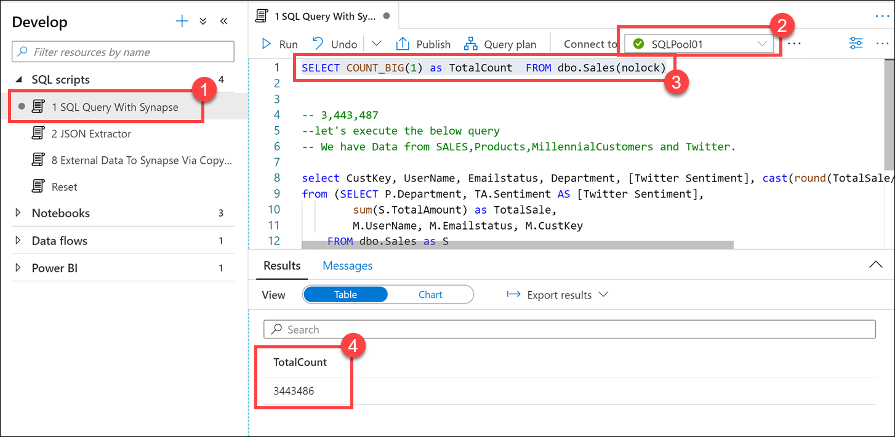

    If we execute the first line in this SQL script, we can see that we have almost 3.5 million rows contained within.

3. **Highlight** the rest of the script (lines 8 - 18) and execute.

    

    One of the benefits of using a modern data warehouse like Synapse Analytics is that you can combine all your data in one place. The script we just executed joins data from a sales database, product catalog, millennial customers extracted from demographics data, and twitter.

4. Select the **2 JSON Extractor (1)** script and make sure you're still connected to **SQLPool01**. Highlight the **first select statement (2)** (line 3). Observe that the data stored in the **TwitterData** column **(3)** is in JSON format.

    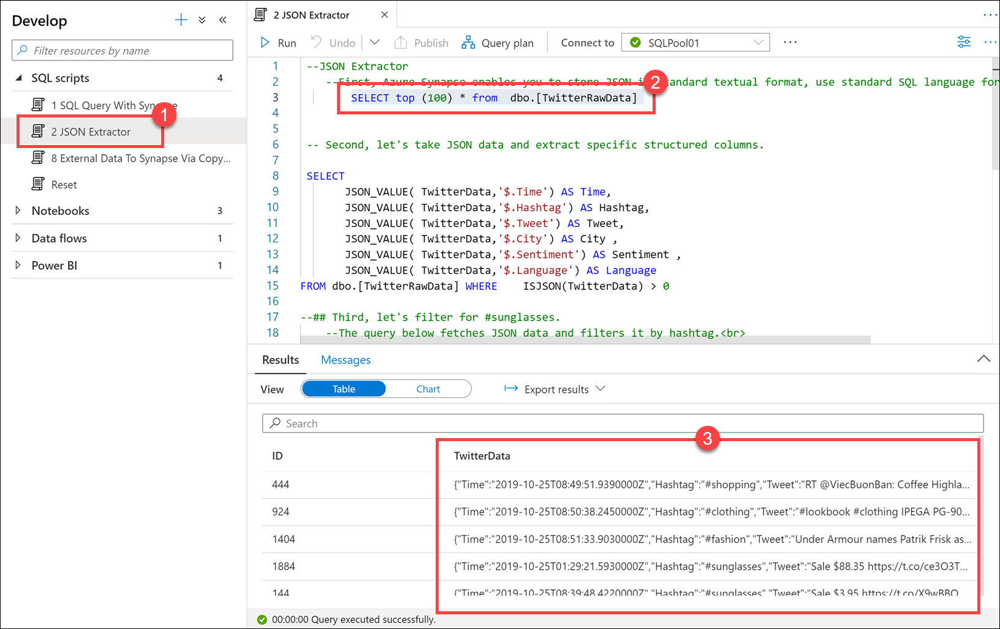

    Azure Synapse enables you to store JSON in standard textual format. Use standard SQL language for querying JSON data.

5. Highlight the next SQL statement (**lines 8 - 15**) and execute.

    

    We can use JSON functions, such as `JSON_VALUE` and `ISJSON` to extract the JSON data and extract it to specific structured columns.

6. Highlight the next SQL statement (**lines 21 - 29**) and execute.

    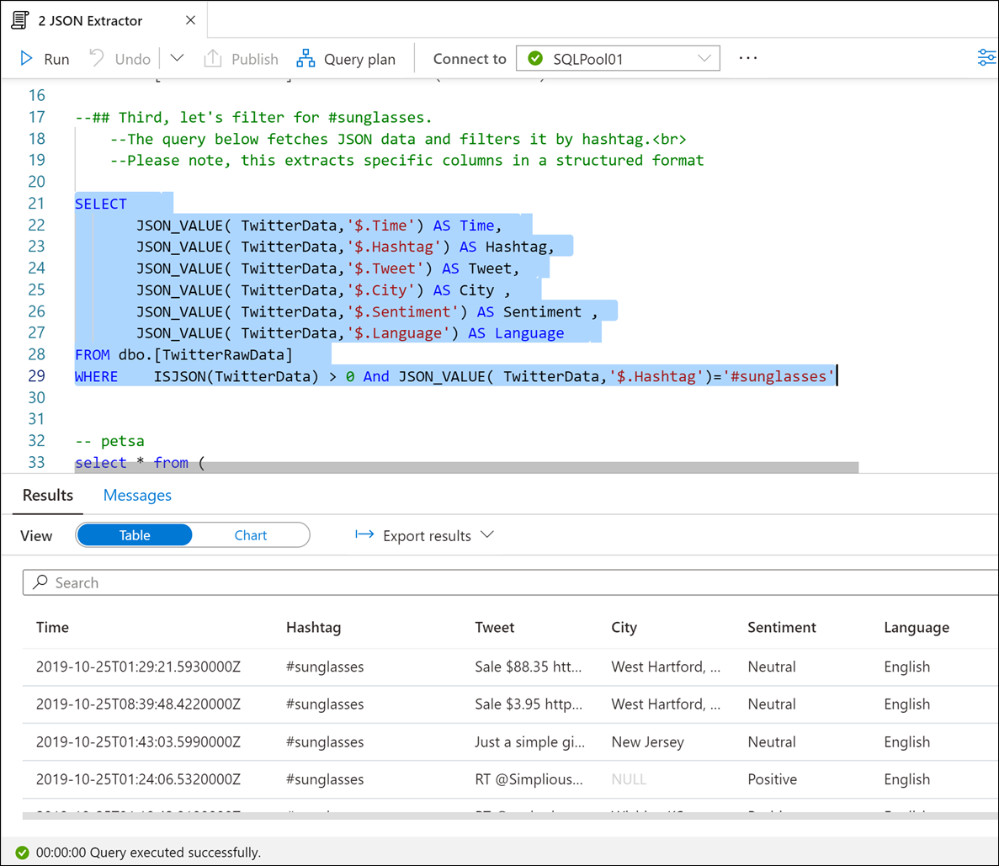

    We want to filter for the **#sunglassess** hashtag. This query fetches and extracts the JSON data into structured columns, then filters on the derived `Hashtag` column.

    > **Note**: The last script does the same thing, but just using a subquery format.

7. Select the **8 External Data To Synapse Via Copy Into (1)** script. **DO NOT EXECUTE**. Scroll through the script file, using the commentary below to explain what it does.

    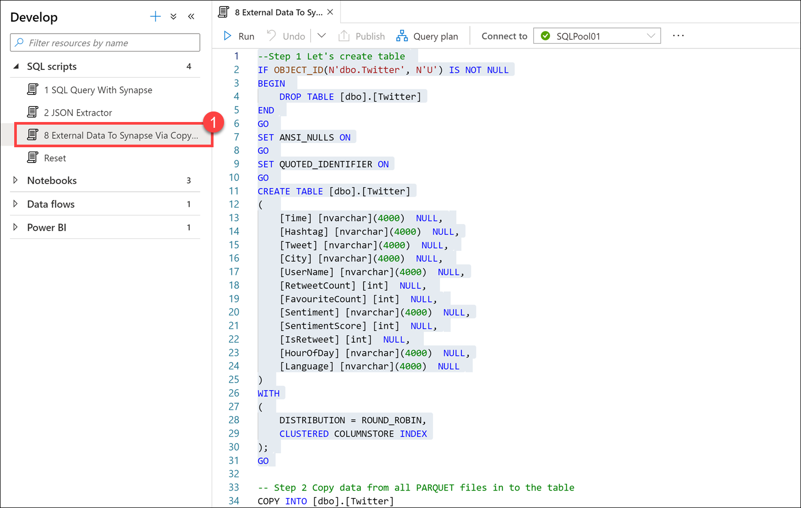

    In this script, we create a table to store Twitter data stored in Parquet files. We use the **COPY** command to quickly and efficiently load all data stored in Parquet files into the new table.

    Finally, we select the first 10 rows to verify the data load.

    The COPY command and PolyBase can be used to import data from various formats into the SQL pool, either through T-SQL scripts like we see here, or from orchestration pipelines.

8. 

### The Orchestrate hub

1. Select the **Orchestrate** hub.

    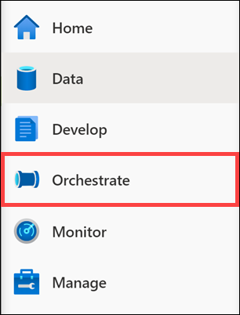

    Manage orchestration pipelines within the Orchestrate hub. If you are familiar with Azure Data Factory, then you will feel at home in this hub. The pipeline creation experience is the same as in ADF, which gives you another powerful integration built in to Synapse Analytics, removing the need to use Azure Data Factory for data movement and transformation pipelines.

### The Monitor hub

1. Select the **Monitor** hub.

    

    Use the Monitor hub to view pipeline and trigger runs, integration runtime status, Apache Spark jobs, SQL requests, and data flow debug activities. If you want to see the status of a job or activity, this is where you want to go.

    The Monitor hub is your first stop for debugging issues and gaining insight on resource usage.

### The Manage hub

1. Select the **Manage** hub.

    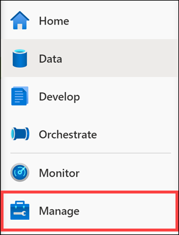

    The Manage hub enables you to perform some of the same actions we saw in the Azure portal, such as managing SQL and Spark pools. However, there is a lot more you can do in this hub that you cannot do anywhere else, such as managing Linked Services and integration runtimes, and creating pipeline triggers.

## Designing a Modern Data Warehouse using Azure Synapse Analytics
