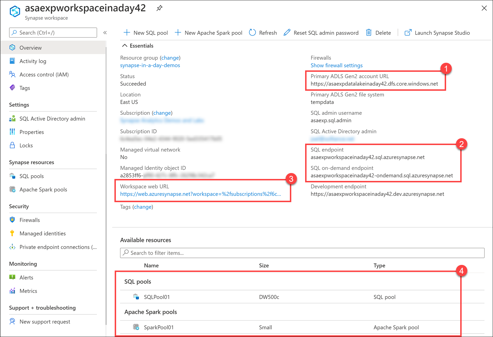
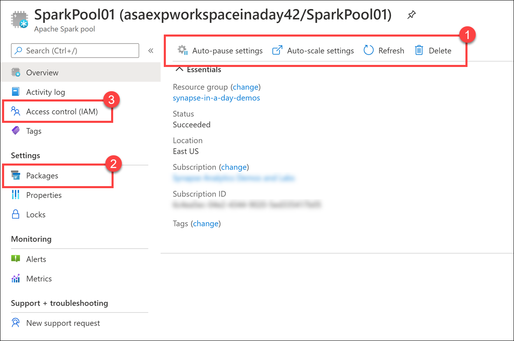

# Realize Integrated Analytical Solutions with Azure Synapse Analytics

## Surveying the Components of Azure Synapse Analytics

1. Start with the Azure resource group, `synapse-in-a-day-demos`.

    

    > The Azure Synapse Analytics components are highlighted in the screenshot above.

    When you deploy Azure Synapse Analytics, there are a few resources that deploy along with it, including the Azure Synapse Workspace and an Azure Data Lake Storage Gen2 (ADLS Gen2) account that acts as the primary storage for the workspace.

    In this example, we have a retail customer that uses Synapse Analytics as the central piece of a modern data warehouse. They ingest data from various sources, cleanse, transform, and analyze the data, train machine learning models, and create various reports. We will show these other related components alongside the Synapse Analytics components as a point of reference, but will focus on Synapse for now.

2. Open the **Synapse workspace**.

    

    The Synapse workspace portal resource contains links to configure your workspace, manage access through Access control (IAM), firewalls, managed identities, and private endpoint connections, and view metrics. It also contains important information about your Synapse Analytics environment, such as:

    1. The **Primary ADLS Gen2 account URL (1)**, which identifies the primary data lake storage account.
    2. The **SQL endpoint** and **SQL on-demand endpoint (2)**, which are used to integrate with external tools, such as SQL Server Management Studio (SSMS), Azure Data Studio, and Power BI.
    3. The **Workspace web URL (3)**, a direct link to Synapse Studio for the workspace.
    4. Available resources, such as **SQL pools** and **Apache Spark pools (4)**.

3. Select the **SQL pool**.

    

    The SQL pool is shown below with the `Essentials` portion of the Overview blade collapsed.

    

    The SQL pool refers to the enterprise data warehousing features formerly provided by SQL Data Warehouse. It represents a collection of analytic resources that are provisioned when using Synapse SQL, vs. on-demand, provided by SQL serverless. The size of SQL pool is determined by Data Warehousing Units (DWU).

    You can access the SQL pool in the portal, as shown here, or from within Synapse Studio, as we'll show you in a bit. When you access SQL pool in the portal, you have configurations and controls not available to you from Synapse Studio. Here are some of the common features you'll access through the portal:

    1. At the top of the window, we see **controls (1)** to pause, scale, restore, set a new restore point, and delete the pool.
    2. Below, **Transparent data encryption (2)** is prominently displayed, letting us quickly see whether it is enabled to encrypt our databases, backups, and logs.
    3. Next to that, we see the **Geo-backup (3)** option and whether it is enabled to backup once per day to a paired data center.
    4. At the bottom of the Overview blade, we see metrics showing the **Data Warehousing Units (DWU) usage** and **Active and queued queries (4)**, allowing us to filter within different time ranges.
    5. The left-hand menu includes some of these options, as well. It is here where you find the **Access control (IAM) (5)** settings to control access to the SQL pool, granted to users and services.

4. Close the SQL pool and open the **Spark pool**.

    

    The Spark pool is shown below.

    

    Apache Spark is a parallel processing framework that supports in-memory processing to boost the performance of big-data analytic applications. Apache Spark in Azure Synapse Analytics is one of Microsoft's implementations of Apache Spark in the cloud. Azure Synapse makes it easy to create and configure a Spark pool in Azure, which is compatible with Azure Storage and Azure Data Lake Storage Gen2. Apache Spark in Azure Synapse supports workloads for data engineers, data analysts, and data scientists.

    Most of the options we see here are also available from within Synapse Studio, including:

    1. Configuring **auto-pause settings**, based on cluster idle time, and **auto-scale settings (1)** based on the amount of activity.
    2. The **Packages (2)** option allows you to upload an environment configuration file (output from the `pip freeze` command) that defines the Python packages to load on the cluster. The packages listed in this file for install or upgrade are downloaded from PyPi at the time of pool startup. This requirements file is used every time a Spark instance is created from that Spark pool.

    On the left-hand menu, you can also find the **Access control (IAM) (3)** settings to control access to the Spark pool, granted to users and services.

5. Select **Packages** on the left-hand menu of the Spark pool.

    

    When you select **Packages (1)** on the left-hand menu, you can view whether a `requirements.txt` file has been added to manage Python packages for Spark instances. You can **upload an environment config file (2)**, or select the ellipses (...) to the **right-hand side of a package file (3)** to access options to re-upload, download, or delete the file.

## Exploring Azure Synapse Studio

## Designing a Modern Data Warehouse using Azure Synapse Analytics
