# Optimize a Data Warehouse with Azure Synapse SQL Pools

In this demo, we show ways you can optimize data warehouse workloads that use the provisioned SQL pools. We cover useful developer features, how to define and use workload management and classification to control data loading, and methods to optimize query performance. The following table of contents describes and links to the elements of the demo:

- [Optimize a Data Warehouse with Azure Synapse SQL Pools](#optimize-a-data-warehouse-with-azure-synapse-sql-pools)
  - [Understanding developer features of Azure Synapse Analytics](#understanding-developer-features-of-azure-synapse-analytics)
    - [Using window functions](#using-window-functions)
      - [OVER clause](#over-clause)
      - [Aggregate functions](#aggregate-functions)
      - [Analytic functions](#analytic-functions)
      - [ROWS clause](#rows-clause)
    - [Approximate execution using HyperLogLog functions](#approximate-execution-using-hyperloglog-functions)
  - [Using data loading best practices in Azure Synapse Analytics](#using-data-loading-best-practices-in-azure-synapse-analytics)
    - [Implement workload management](#implement-workload-management)
    - [Create a workload classifier to add importance to certain queries](#create-a-workload-classifier-to-add-importance-to-certain-queries)
    - [Reserve resources for specific workloads through workload isolation](#reserve-resources-for-specific-workloads-through-workload-isolation)
  - [Optimizing data warehouse query performance in Azure Synapse Analytics](#optimizing-data-warehouse-query-performance-in-azure-synapse-analytics)
    - [Identify performance issues related to tables](#identify-performance-issues-related-to-tables)
    - [Create hash distribution and columnstore index](#create-hash-distribution-and-columnstore-index)
    - [Improve table structure with partitioning](#improve-table-structure-with-partitioning)
      - [Table distributions](#table-distributions)
      - [Indexes](#indexes)
      - [Partitioning](#partitioning)
    - [Use result set caching](#use-result-set-caching)

## Understanding developer features of Azure Synapse Analytics

### Using window functions

Tailwind Traders is looking for ways to more efficiently analyze their sales data without relying on expensive cursors, subqueries, and other outdated methods they use today.

You propose using window functions to perform calculations over a set of rows. With these functions, you treat groups of rows as an entity.

#### OVER clause

One of the key components of window functions is the **`OVER`** clause. This clause determines the partitioning and ordering of a rowset before the associated window function is applied. That is, the OVER clause defines a window or user-specified set of rows within a query result set. A window function then computes a value for each row in the window. You can use the OVER clause with functions to compute aggregated values such as moving averages, cumulative aggregates, running totals, or a top N per group results.

1. Select the **Develop** hub.

    

2. From the **Develop** menu, select the **+** button **(1)** and choose **SQL Script (2)** from the context menu.

    

3. In the toolbar menu, connect to the **SQL Pool** database to execute the query.

    

4. In the query window, replace the script with the following to use the `OVER` clause with data from the `wwi_security.Sale` table:

    ```sql
    SELECT
      ROW_NUMBER() OVER(PARTITION BY Region ORDER BY Quantity DESC) AS "Row Number",
      Product,
      Quantity,
      Region
    FROM wwi_security.Sale
    WHERE Quantity <> 0  
    ORDER BY Region;
    ```

5. Select **Run** from the toolbar menu to execute the SQL command.

    

    When we use `PARTITION BY` with the `OVER` clause **(1)**, we divide the query result set into partitions. The window function is applied to each partition separately and computation restarts for each partition.

    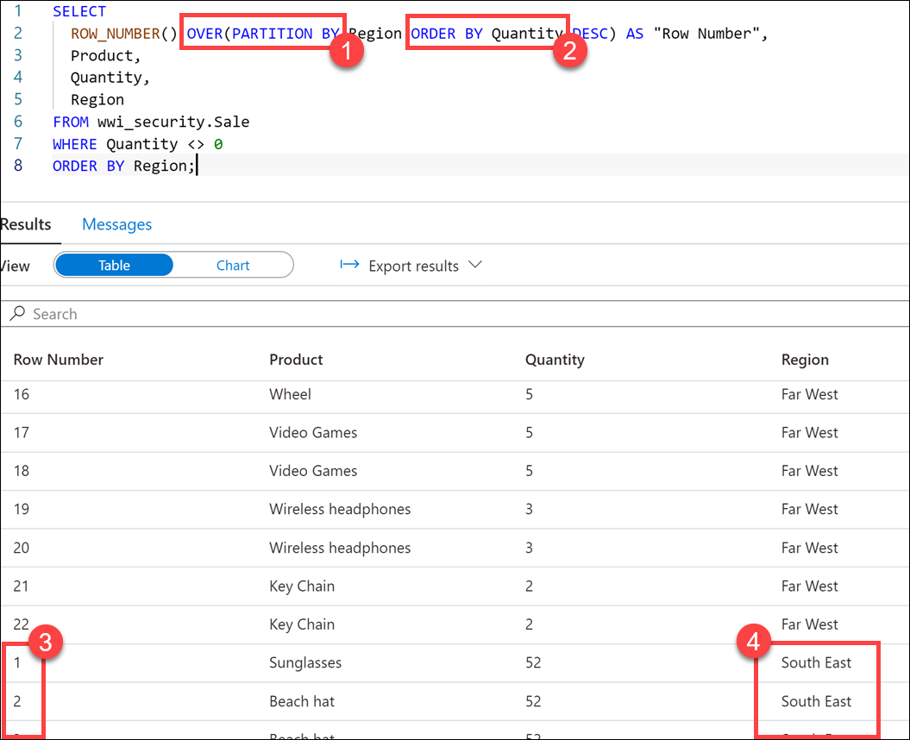

    The script we executed uses the OVER clause with ROW_NUMBER function **(1)** to display a row number for each row within a partition. The partition in our case is the `Region` column. The ORDER BY clause **(2)** specified in the OVER clause orders the rows in each partition by the column `Quantity`. The ORDER BY clause in the SELECT statement determines the order in which the entire query result set is returned.

    **Scroll down** in the results view until the **Row Number** count **(3)** starts over with a **different region (4)**. Since the partition is set to `Region`, the `ROW_NUMBER` resets when the region changes. Essentially, we've partitioned by region and have a result set identified by the number of rows in that region.

#### Aggregate functions

Now let's use aggregate functions with our window by expanding on our query that uses the OVER clause.

1. In the query window, replace the script with the following to add aggregate functions:

    ```sql
    SELECT
      ROW_NUMBER() OVER(PARTITION BY Region ORDER BY Quantity DESC) AS "Row Number",
      Product,
      Quantity,
      SUM(Quantity) OVER(PARTITION BY Region) AS Total,  
      AVG(Quantity) OVER(PARTITION BY Region) AS Avg,  
      COUNT(Quantity) OVER(PARTITION BY Region) AS Count,  
      MIN(Quantity) OVER(PARTITION BY Region) AS Min,  
      MAX(Quantity) OVER(PARTITION BY Region) AS Max,
      Region
    FROM wwi_security.Sale
    WHERE Quantity <> 0  
    ORDER BY Region;
    ```

2. Select **Run** from the toolbar menu to execute the SQL command.

    

    In our query, we added the `SUM`, `AVG`, `COUNT`, `MIN`, and `MAX` aggregate functions. Using the OVER clause is more efficient than using subqueries.

    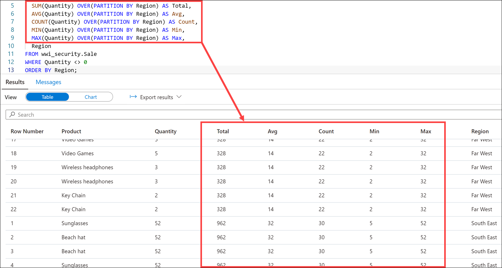

#### Analytic functions

Analytic functions calculate an aggregate value based on a group of rows. Unlike aggregate functions, however, analytic functions can return multiple rows for each group. Use analytic functions to compute moving averages, running totals, percentages, or top-N results within a group.

Tailwind Traders has book sales data they import from their online store and wish to compute percentages of book downloads by category.

To do this, you decide to build window functions that use the `PERCENTILE_CONT` and `PERCENTILE_DISC` functions.

1. In the query window, replace the script with the following to add aggregate functions:

    ```sql
    -- PERCENTILE_CONT, PERCENTILE_DISC
    SELECT DISTINCT c.Category  
    ,PERCENTILE_CONT(0.5) WITHIN GROUP (ORDER BY bc.Downloads)
                          OVER (PARTITION BY Category) AS MedianCont  
    ,PERCENTILE_DISC(0.5) WITHIN GROUP (ORDER BY bc.Downloads)
                          OVER (PARTITION BY Category) AS MedianDisc  
    FROM dbo.Category AS c  
    INNER JOIN dbo.BookList AS bl
        ON bl.CategoryID = c.ID
    INNER JOIN dbo.BookConsumption AS bc  
        ON bc.BookID = bl.ID
    ORDER BY Category
    ```

2. Select **Run** from the toolbar menu to execute the SQL command.

    

    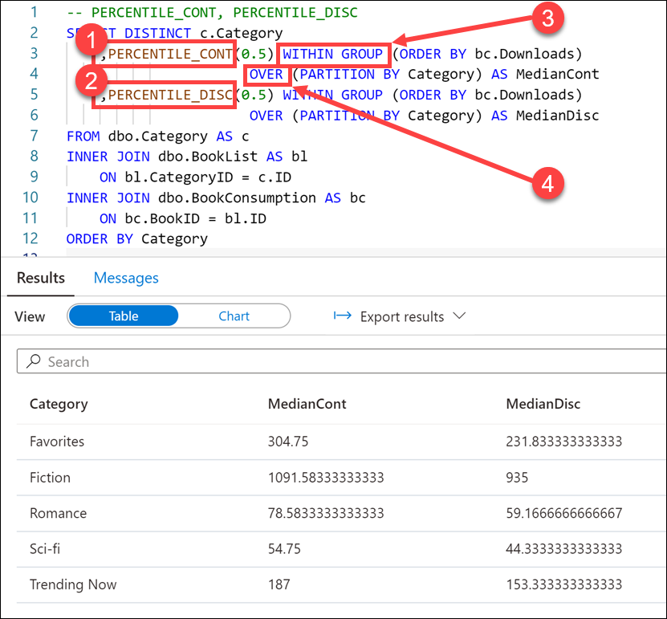

    In this query, we use **PERCENTILE_CONT (1)** and **PERCENTILE_DISC (2)** to find the median number of downloads in each book category. These functions may not return the same value. PERCENTILE_CONT interpolates the appropriate value, which may or may not exist in the data set, while PERCENTILE_DISC always returns an actual value from the set. To explain further, PERCENTILE_DISC computes a specific percentile for sorted values in an entire rowset or within a rowset's distinct partitions.

    > The `0.5` value passed to the **percentile functions (1 & 2)** computes the 50th percentile, or the median, of the downloads.

    The **WITHIN GROUP** expression **(3)** specifies a list of values to sort and compute the percentile over. Only one ORDER BY expression is allowed, and the default sort order is ascending.

    The **OVER** clause **(4)** divides the FROM clause's result set into partitions, in this case, `Category`. The percentile function is applied to these partitions.

3. In the query window, replace the script with the following to use the LAG analytic function:

    ```sql
    --LAG Function
    SELECT ProductId,
        [Hour] AS SalesHour,
        TotalAmount AS CurrentSalesTotal,
        LAG(TotalAmount, 1,0) OVER (ORDER BY [Hour]) AS PreviousSalesTotal,
        TotalAmount - LAG(TotalAmount,1,0) OVER (ORDER BY [Hour]) AS Diff
    FROM [wwi_perf].[Sale_Index]
    WHERE ProductId = 3848 AND [Hour] BETWEEN 8 AND 20;
    ```

    Tailwind Traders wants to compare the sales totals for a product over an hourly basis over time, showing the difference in value.

    To accomplish this, you use the LAG analytic function. This function accesses data from a previous row in the same result set without the use of a self-join. LAG provides access to a row at a given physical offset that comes before the current row. We use this analytic function to compare values in the current row with values in a previous row.

4. Select **Run** from the toolbar menu to execute the SQL command.

    

    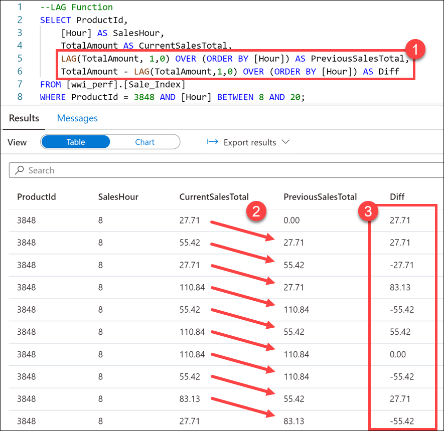

    In this query, we use the **LAG function (1)** to return the **difference in sales (2)** for a specific product over peak sales hours (8-20). We also calculate the difference in sales from one row to the next **(3)**. Notice that because there is no lag value available for the first row, the default of zero (0) is returned.

#### ROWS clause

The ROWS and RANGE clauses further limit the rows within the partition by specifying start and end points within the partition. This is done by specifying a range of rows with respect to the current row either by logical association or physical association. Physical association is achieved by using the ROWS clause.

Tailwind Traders wants to find the books that have the fewest downloads by country, while displaying the total number of downloads for each book within each country in ascending order.

To achieve this, you use ROWS in combination with UNBOUNDED PRECEDING to limit the rows within the `Country` partition, specifying that the window start with the first row of the partition.

1. In the query window, replace the script with the following to add aggregate functions:

    ```sql
    -- ROWS UNBOUNDED PRECEDING
    SELECT DISTINCT bc.Country, b.Title AS Book, bc.Downloads
        ,FIRST_VALUE(b.Title) OVER (PARTITION BY Country  
            ORDER BY Downloads ASC ROWS UNBOUNDED PRECEDING) AS FewestDownloads
    FROM dbo.BookConsumption AS bc
    INNER JOIN dbo.Books AS b
        ON b.ID = bc.BookID
    ORDER BY Country, Downloads
    ```

2. Select **Run** from the toolbar menu to execute the SQL command.

    

    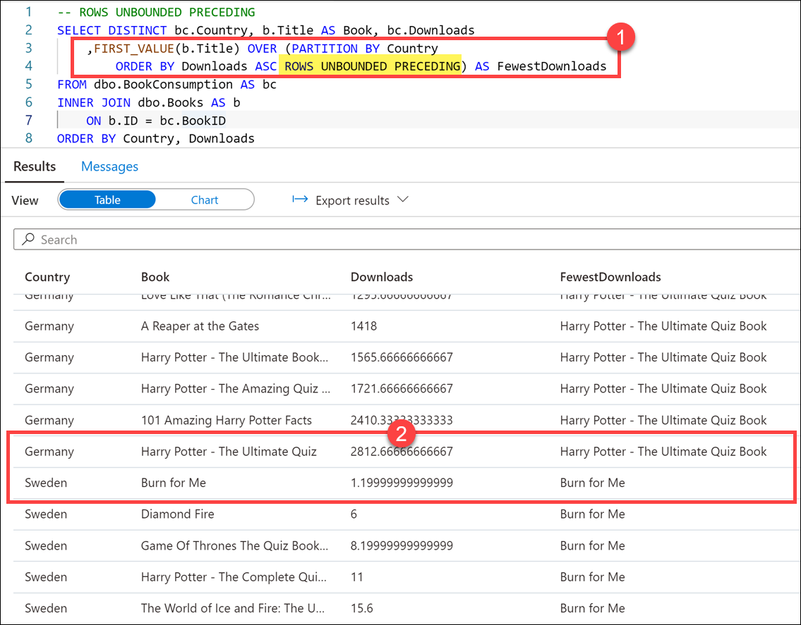

    In this query, we use the `FIRST_VALUE` analytic function to retrieve the book title with the fewest downloads, as indicated by the **`ROWS UNBOUNDED PRECEDING`** clause over the `Country` partition **(1)**. The `UNBOUNDED PRECEDING` option set the window start to the first row of the partition, giving us the title of the book with the fewest downloads for the country within the partition.
    
    In the result set, we can scroll through the list that of books by country, sorted by number of downloads in ascending order. Here we see that for Germany, `Harry Potter - The Ultimate Quiz Book` (not to be confused with `Harry Potter - The Ultimate Quiz`, which had the most) had the fewest downloads, and `Burn for Me` had the fewest in Sweden **(2)**.

### Approximate execution using HyperLogLog functions

## Using data loading best practices in Azure Synapse Analytics

### Implement workload management

Running mixed workloads can pose resource challenges on busy systems. Solution Architects seek ways to separate classic data warehousing activities (such as loading, transforming, and querying data) to ensure that enough resources exist to hit SLAs.

Synapse SQL pool workload management in Azure Synapse consists of three high-level concepts: Workload Classification, Workload Importance and Workload Isolation. These capabilities give you more control over how your workload utilizes system resources.

Workload importance influences the order in which a request gets access to resources. On a busy system, a request with higher importance has first access to resources. Importance can also ensure ordered access to locks.

Workload isolation reserves resources for a workload group. Resources reserved in a workload group are held exclusively for that workload group to ensure execution. Workload groups also allow you to define the amount of resources that are assigned per request, much like resource classes do. Workload groups give you the ability to reserve or cap the amount of resources a set of requests can consume. Finally, workload groups are a mechanism to apply rules, such as query timeout, to requests.

### Create a workload classifier to add importance to certain queries

Tailwind Traders has asked you if there is a way to mark queries executed by the CEO as more important than others, so they don't appear slow due to heavy data loading or other workloads in the queue. You decide to create a workload classifier and add importance to prioritize the CEO's queries.

1. Select the **Develop** hub.

    

2. From the **Develop** menu, select the **+** button **(1)** and choose **SQL Script (2)** from the context menu.

    

3. In the toolbar menu, connect to the **SQL Pool** database to execute the query.

    

4. In the query window, replace the script with the following to confirm that there are no queries currently being run by users logged in as `asa.sql.workload01`, representing the CEO of the organization or `asa.sql.workload02` representing the data analyst working on the project:

    ```sql
    --First, let's confirm that there are no queries currently being run by users logged in workload01 or workload02

    SELECT s.login_name, r.[Status], r.Importance, submit_time, 
    start_time ,s.session_id FROM sys.dm_pdw_exec_sessions s 
    JOIN sys.dm_pdw_exec_requests r ON s.session_id = r.session_id
    WHERE s.login_name IN ('asa.sql.workload01','asa.sql.workload02') and Importance
    is not NULL AND r.[status] in ('Running','Suspended') 
    --and submit_time>dateadd(minute,-2,getdate())
    ORDER BY submit_time ,s.login_name
    ```

5. Select **Run** from the toolbar menu to execute the SQL command.

    

    Now that we have confirmed that there are no running queries, we need to flood the system with queries and see what happens for `asa.sql.workload01` and `asa.sql.workload02`. To do this, we'll run a Azure Synapse Pipeline which triggers queries.

6. Select the **Orchestrate** hub.

    

7. Select the **Lab 08 - Execute Data Analyst and CEO Queries** Pipeline **(1)**, which will run / trigger the `asa.sql.workload01` and `asa.sql.workload02` queries. Select **Add trigger (2)**, then **Trigger now (3)**. In the dialog that appears, select **OK**.

    

    > **Note to presenter**: Leave this tab open since you will come back to this pipeline again.

8. Let's see what happened to all the queries we just triggered as they flood the system. In the query window, replace the script with the following:

    ```sql
    SELECT s.login_name, r.[Status], r.Importance, submit_time, start_time ,s.session_id FROM sys.dm_pdw_exec_sessions s 
    JOIN sys.dm_pdw_exec_requests r ON s.session_id = r.session_id
    WHERE s.login_name IN ('asa.sql.workload01','asa.sql.workload02') and Importance
    is not NULL AND r.[status] in ('Running','Suspended') and submit_time>dateadd(minute,-2,getdate())
    ORDER BY submit_time ,status
    ```

9. Select **Run** from the toolbar menu to execute the SQL command.

    

    You should see an output similar to the following:

    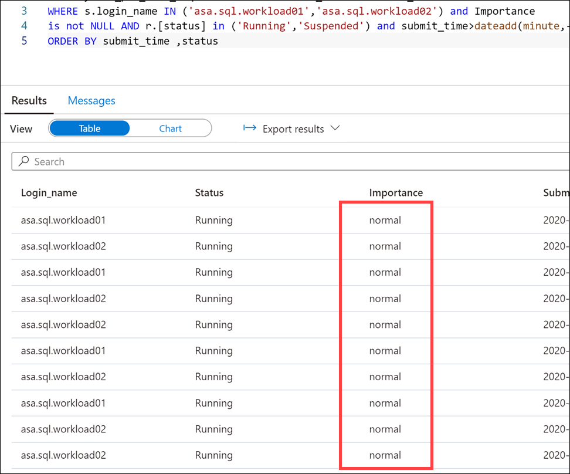

    > **Note to presenter**: This query could take over a minute to execute.

    Notice that the **Importance** level for all queries is set to **normal**.

10. We will give our `asa.sql.workload01` user queries priority by implementing the **Workload Importance** feature. In the query window, replace the script with the following:

    ```sql
    IF EXISTS (SELECT * FROM sys.workload_management_workload_classifiers WHERE name = 'CEO')
    BEGIN
        DROP WORKLOAD CLASSIFIER CEO;
    END
    CREATE WORKLOAD CLASSIFIER CEO
      WITH (WORKLOAD_GROUP = 'largerc'
      ,MEMBERNAME = 'asa.sql.workload01',IMPORTANCE = High);
    ```

    We are executing this script to create a new **Workload Classifier** named `CEO` that uses the `largerc` Workload Group and sets the **Importance** level of the queries to **High**.

11. Select **Run** from the toolbar menu to execute the SQL command.

    

12. Let's flood the system again with queries and see what happens this time for `asa.sql.workload01` and `asa.sql.workload02` queries. To do this, we'll run an Azure Synapse Pipeline which triggers queries. **Select** the `Orchestrate` Tab, **run** the **Lab 08 - Execute Data Analyst and CEO Queries** Pipeline, which will run / trigger the `asa.sql.workload01` and `asa.sql.workload02` queries.

13. In the query window, replace the script with the following to see what happens to the `asa.sql.workload01` queries this time:

    ```sql
    SELECT s.login_name, r.[Status], r.Importance, submit_time, start_time ,s.session_id FROM sys.dm_pdw_exec_sessions s 
    JOIN sys.dm_pdw_exec_requests r ON s.session_id = r.session_id
    WHERE s.login_name IN ('asa.sql.workload01','asa.sql.workload02') and Importance
    is not NULL AND r.[status] in ('Running','Suspended') and submit_time>dateadd(minute,-2,getdate())
    ORDER BY submit_time ,status desc
    ```

14. Select **Run** from the toolbar menu to execute the SQL command.

    

    You should see an output similar to the following:

    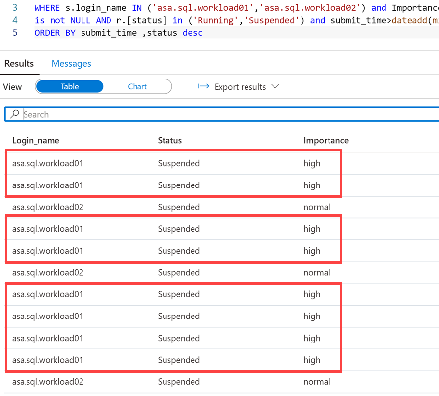

    Notice that the queries executed by the `asa.sql.workload01` user have a **high** importance.

15. Select the **Monitor** hub.

    

16. Select **Pipeline runs (1)**, and then select **Cancel recursive (2)** for each running Lab 08 pipelines, marked **In progress (3)**. This will help speed up the remaining tasks.

    

### Reserve resources for specific workloads through workload isolation

Workload isolation means resources are reserved, exclusively, for a workload group. Workload groups are containers for a set of requests and are the basis for how workload management, including workload isolation, is configured on a system. A simple workload management configuration can manage data loads and user queries.

In the absence of workload isolation, requests operate in the shared pool of resources. Access to resources in the shared pool is not guaranteed and is assigned on an importance basis.

Given the workload requirements provided by Tailwind Traders, you decide to create a new workload group called `CEODemo` to reserve resources for queries executed by the CEO.

Let's start by experimenting with different parameters.

1. In the query window, replace the script with the following:

    ```sql
    IF NOT EXISTS (SELECT * FROM sys.workload_management_workload_groups where name = 'CEODemo')
    BEGIN
        Create WORKLOAD GROUP CEODemo WITH  
        ( MIN_PERCENTAGE_RESOURCE = 50        -- integer value
        ,REQUEST_MIN_RESOURCE_GRANT_PERCENT = 25 --  
        ,CAP_PERCENTAGE_RESOURCE = 100
        )
    END
    ```

    The script creates a workload group called `CEODemo` to reserve resources exclusively for the workload group. In this example, a workload group with a `MIN_PERCENTAGE_RESOURCE` set to 50% and `REQUEST_MIN_RESOURCE_GRANT_PERCENT` set to 25% is guaranteed 2 concurrency.

2. Select **Run** from the toolbar menu to execute the SQL command.

    

3. In the query window, replace the script with the following to create a Workload Classifier called `CEODreamDemo` that assigns a workload group and importance to incoming requests:

    ```sql
    IF NOT EXISTS (SELECT * FROM sys.workload_management_workload_classifiers where  name = 'CEODreamDemo')
    BEGIN
        Create Workload Classifier CEODreamDemo with
        ( Workload_Group ='CEODemo',MemberName='asa.sql.workload02',IMPORTANCE = BELOW_NORMAL);
    END
    ```

    This script sets the Importance to **BELOW_NORMAL** for the `asa.sql.workload02` user, through the new `CEODreamDemo` Workload Classifier.

4. Select **Run** from the toolbar menu to execute the SQL command.

    

5. In the query window, replace the script with the following to confirm that there are no active queries being run by `asa.sql.workload02` (suspended queries are OK):

    ```sql
    SELECT s.login_name, r.[Status], r.Importance, submit_time,
    start_time ,s.session_id FROM sys.dm_pdw_exec_sessions s
    JOIN sys.dm_pdw_exec_requests r ON s.session_id = r.session_id
    WHERE s.login_name IN ('asa.sql.workload02') and Importance
    is not NULL AND r.[status] in ('Running','Suspended')
    ORDER BY submit_time, status
    ```

6. Select **Run** from the toolbar menu to execute the SQL command.

    

7. Select the **Orchestrate** hub.

    

8. Select the **Lab 08 - Execute Business Analyst Queries** Pipeline **(1)**, which will run / trigger  `asa.sql.workload02` queries. Select **Add trigger (2)**, then **Trigger now (3)**. In the dialog that appears, select **OK**.

    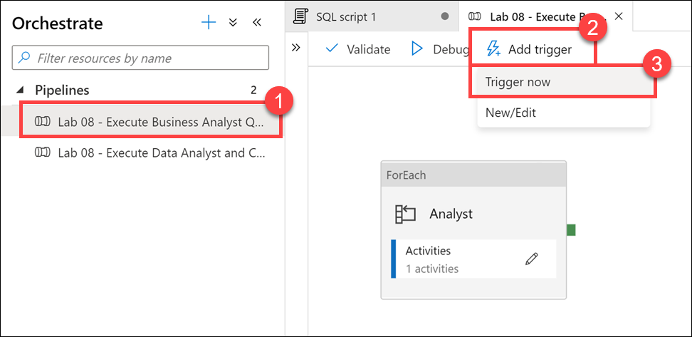

    > **Note to presenter**: Leave this tab open since you will come back to this pipeline again.

9. In the query window, replace the script with the following to see what happened to all the `asa.sql.workload02` queries we just triggered as they flood the system:

    ```sql
    SELECT s.login_name, r.[Status], r.Importance, submit_time,
    start_time ,s.session_id FROM sys.dm_pdw_exec_sessions s
    JOIN sys.dm_pdw_exec_requests r ON s.session_id = r.session_id
    WHERE s.login_name IN ('asa.sql.workload02') and Importance
    is not NULL AND r.[status] in ('Running','Suspended')
    ORDER BY submit_time, status
    ```

10. Select **Run** from the toolbar menu to execute the SQL command.

    

    You should see an output similar to the following that shows the importance for each session set to `below_normal`:

    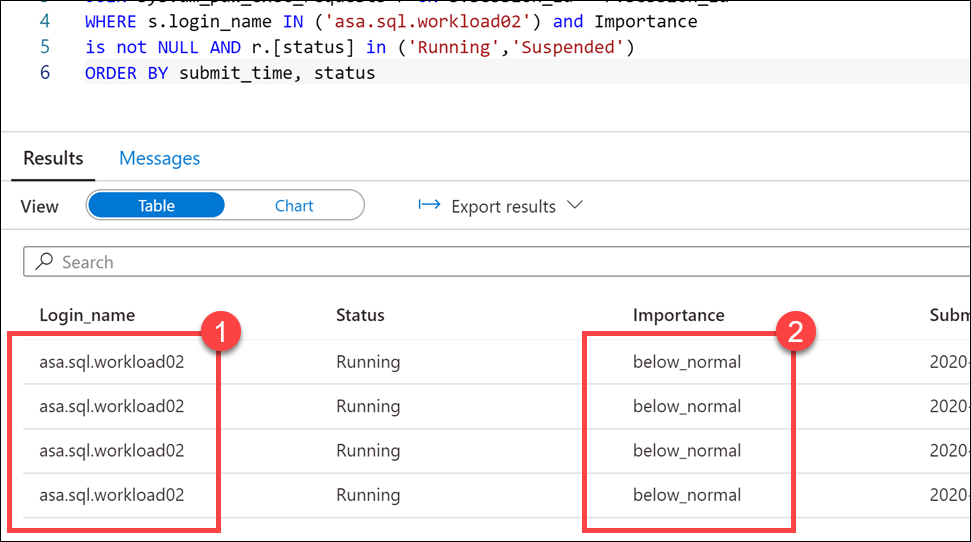

    Notice that the running scripts are executed by the `asa.sql.workload02` user **(1)** with an Importance level of **below_normal (2)**. We have successfully configured the business analyst queries to execute at a lower importance than the CEO queries. We can also see that the `CEODreamDemo` Workload Classifier works as expected.

11. Select the **Monitor** hub.

    

12. Select **Pipeline runs (1)**, and then select **Cancel recursive (2)** for each running Lab 08 pipelines, marked **In progress (3)**. This will help speed up the remaining tasks.

    

13. Return to the query window under the **Develop** hub. In the query window, replace the script with the following to set 3.25% minimum resources per request:

    ```sql
    IF  EXISTS (SELECT * FROM sys.workload_management_workload_classifiers where group_name = 'CEODemo')
    BEGIN
        Drop Workload Classifier CEODreamDemo
        DROP WORKLOAD GROUP CEODemo
        --- Creates a workload group 'CEODemo'.
            Create  WORKLOAD GROUP CEODemo WITH  
        (MIN_PERCENTAGE_RESOURCE = 26 -- integer value
            ,REQUEST_MIN_RESOURCE_GRANT_PERCENT = 3.25 -- factor of 26 (guaranteed more than 4 concurrencies)
        ,CAP_PERCENTAGE_RESOURCE = 100
        )
        --- Creates a workload Classifier 'CEODreamDemo'.
        Create Workload Classifier CEODreamDemo with
        (Workload_Group ='CEODemo',MemberName='asa.sql.workload02',IMPORTANCE = BELOW_NORMAL);
    END
    ```

    > **Note**: Configuring workload containment implicitly defines a maximum level of concurrency. With a CAP_PERCENTAGE_RESOURCE set to 60% and a REQUEST_MIN_RESOURCE_GRANT_PERCENT set to 1%, up to a 60-concurrency level is allowed for the workload group. Consider the method included below for determining the maximum concurrency:
    > 
    > [Max Concurrency] = [CAP_PERCENTAGE_RESOURCE] / [REQUEST_MIN_RESOURCE_GRANT_PERCENT]

14. Select **Run** from the toolbar menu to execute the SQL command.

    

15. Let's flood the system again and see what happens for `asa.sql.workload02`. To do this, we will run an Azure Synapse Pipeline which triggers queries. Select the `Orchestrate` Tab. **Run** the **Lab 08 - Execute Business Analyst Queries** Pipeline, which will run / trigger  `asa.sql.workload02` queries.

16. In the query window, replace the script with the following to see what happened to all of the `asa.sql.workload02` queries we just triggered as they flood the system:

    ```sql
    SELECT s.login_name, r.[Status], r.Importance, submit_time,
    start_time ,s.session_id FROM sys.dm_pdw_exec_sessions s
    JOIN sys.dm_pdw_exec_requests r ON s.session_id = r.session_id
    WHERE s.login_name IN ('asa.sql.workload02') and Importance
    is  not NULL AND r.[status] in ('Running','Suspended')
    ORDER BY submit_time, status
    ```

17. Select **Run** from the toolbar menu to execute the SQL command.

    

    After several moments (up to a minute), we should see several concurrent executions by the `asa.sql.workload02` user running at **below_normal** importance. We have validated that the modified Workload Group and Workload Classifier works as expected.

    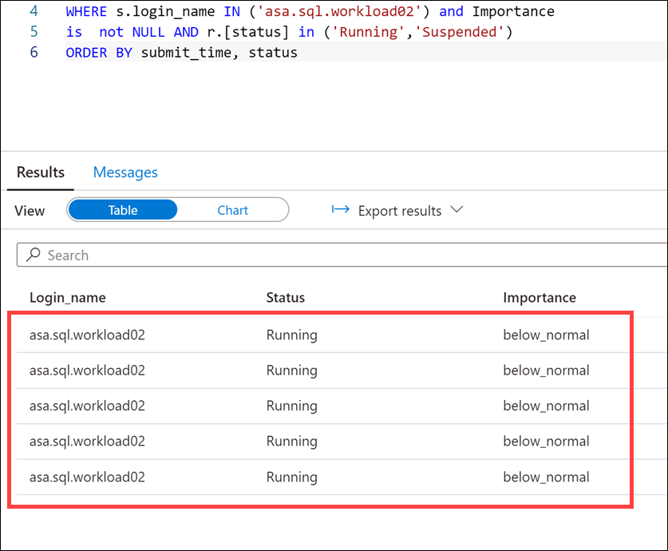

18. Select the **Monitor** hub.

    

19. Select **Pipeline runs (1)**, and then select **Cancel recursive (2)** for each running Lab 08 pipelines, marked **In progress (3)**. This will help speed up the remaining tasks.

    

## Optimizing data warehouse query performance in Azure Synapse Analytics

### Identify performance issues related to tables

1. Select the **Develop** hub.

    

2. From the **Develop** menu, select the **+** button **(1)** and choose **SQL Script (2)** from the context menu.

    

3. In the toolbar menu, connect to the **SQL Pool** database to execute the query.

    

4. In the query window, replace the script with the following:

    ```sql
    SELECT  
        COUNT_BIG(*)
    FROM
        [wwi_perf].[Sale_Heap]
    ```

5. Select **Run** from the toolbar menu to execute the SQL command.

    

    The script takes up to **15 seconds** to execute and returns a count of ~ 340 million rows in the table.

    > **Note to presenter**: _Do not_ execute this query ahead of time. If you do, the query may run faster during subsequent executions.

    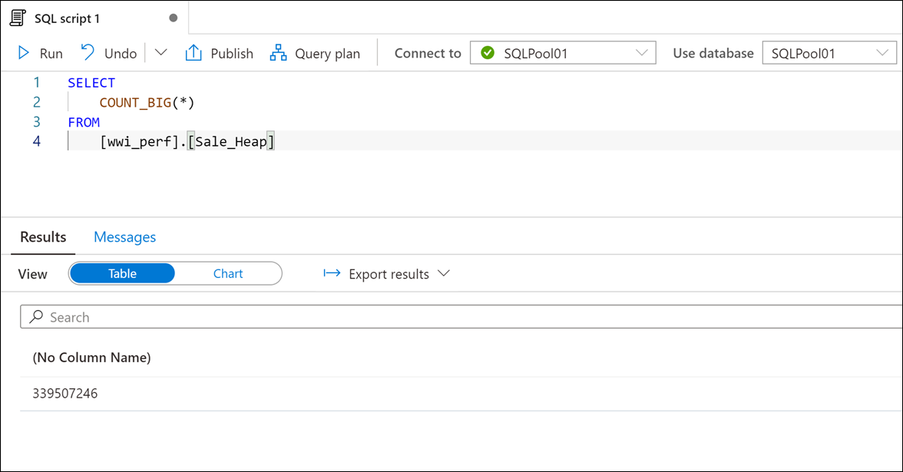

6. In the query window, replace the script with the following (more complex) statement:

    ```sql
    SELECT TOP 1000 * FROM
    (
        SELECT
            S.CustomerId
            ,SUM(S.TotalAmount) as TotalAmount
        FROM
            [wwi_perf].[Sale_Heap] S
        GROUP BY
            S.CustomerId
    ) T
    OPTION (LABEL = 'Lab03: Heap')
    ```

7. Select **Run** from the toolbar menu to execute the SQL command.

    
  
    The script takes up to **30 seconds** to execute and returns the result. There is clearly something wrong with the `Sale_Heap` table that induces the performance hit.

    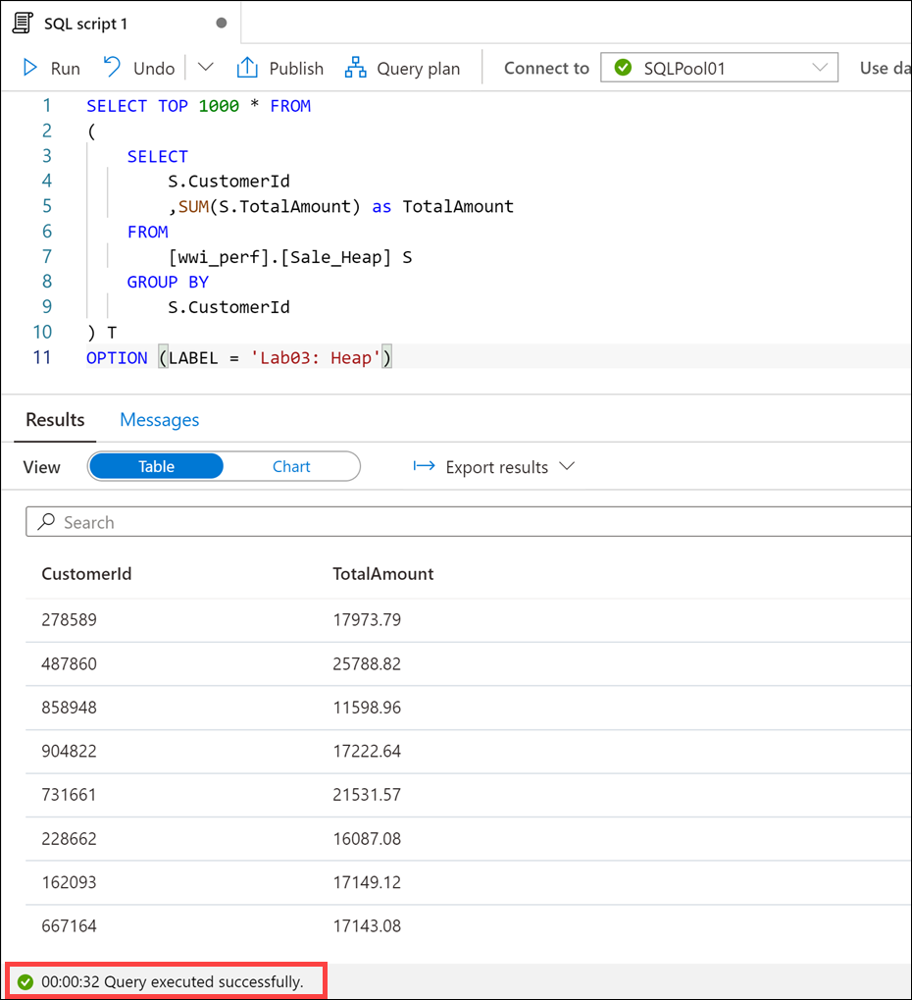

    > Note the OPTION clause used in the statement. This comes in handy when you're looking to identify your query in the [sys.dm_pdw_exec_requests](https://docs.microsoft.com/en-us/sql/relational-databases/system-dynamic-management-views/sys-dm-pdw-exec-requests-transact-sql) DMV.
    >
    >```sql
    >SELECT  *
    >FROM    sys.dm_pdw_exec_requests
    >WHERE   [label] = 'Lab03: Heap';
    >```

8. Select the **Data** hub.

    

9. Expand the **SQLPool01** database and its list of **Tables (1)**. Right-click **`wwi_perf.Sale_Heap` (2)**, select **New SQL script (3)**, then select **CREATE (4)**.

    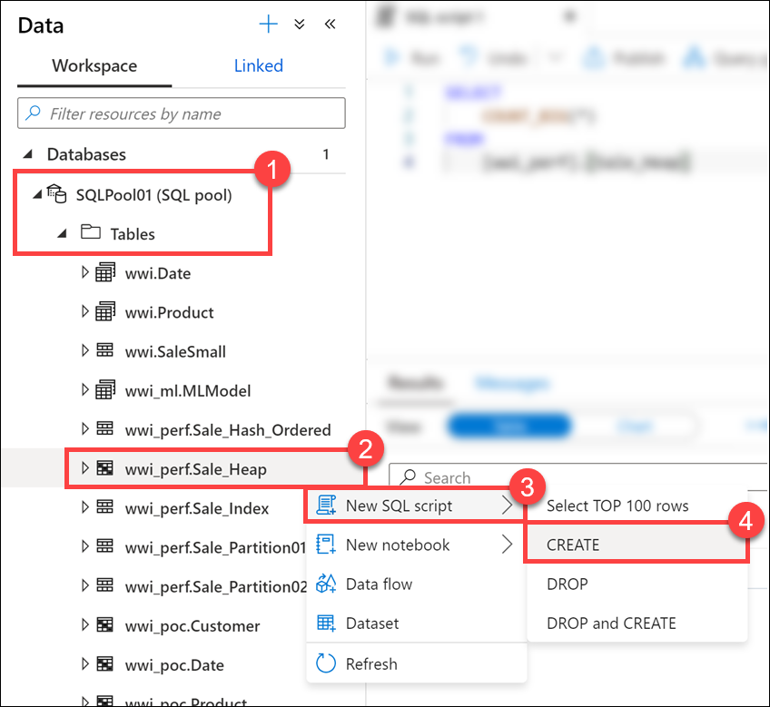

10. Take a look at the script used to create the table:

    ```sql
    CREATE TABLE [wwi_perf].[Sale_Heap]
    ( 
      [TransactionId] [uniqueidentifier]  NOT NULL,
      [CustomerId] [int]  NOT NULL,
      [ProductId] [smallint]  NOT NULL,
      [Quantity] [tinyint]  NOT NULL,
      [Price] [decimal](9,2)  NOT NULL,
      [TotalAmount] [decimal](9,2)  NOT NULL,
      [TransactionDateId] [int]  NOT NULL,
      [ProfitAmount] [decimal](9,2)  NOT NULL,
      [Hour] [tinyint]  NOT NULL,
      [Minute] [tinyint]  NOT NULL,
      [StoreId] [smallint]  NOT NULL
    )
    WITH
    (
      DISTRIBUTION = ROUND_ROBIN,
      HEAP
    )
    ```

    You can immediately spot at least two reasons for the performance hit:

    - The `ROUND_ROBIN` distribution
    - The `HEAP` structure of the table

    > **NOTE**
    >
    > In this case, when we are looking for fast query response times, the heap structure is not a good choice as we will see in a moment. Still, there are cases where using a heap table can help performance rather than hurting it. One such example is when we're looking to ingest large amounts of data into the SQL pool.

    If we were to review the query plan in detail, we would clearly see the root cause of the performance problem: inter-distribution data movements.

    Data movement is an operation where parts of the distributed tables are moved to different nodes during query execution. This operation is required where the data is not available on the target node, most commonly when the tables do not share the distribution key. The most common data movement operation is shuffle. During shuffle, for each input row, Synapse computes a hash value using the join columns and then sends that row to the node that owns that hash value. Either one or both sides of join can participate in the shuffle. The diagram below displays shuffle to implement join between tables T1 and T2 where neither of the tables is distributed on the join column col2.

    

    This is actually one of the simplest examples given the small size of the data that needs to be shuffled. You can imagine how much worse things become when the shuffled row size becomes larger.

### Create hash distribution and columnstore index

1. Select the **Develop** hub.

    

2. From the **Develop** menu, select the **+** button **(1)** and choose **SQL Script (2)** from the context menu.

    

3. In the toolbar menu, connect to the **SQL Pool** database to execute the query.

    

4. In the query window, replace the script with the following:

     ```sql
    CREATE TABLE [wwi_perf].[Sale_Hash]
    WITH
    (
        DISTRIBUTION = HASH ( [CustomerId] ),
        CLUSTERED COLUMNSTORE INDEX
    )
    AS
    SELECT
        *
    FROM
        [wwi_perf].[Sale_Heap]
    ```

5. Select **Run** from the toolbar menu to execute the SQL command.

    

    The query will take up to **4.5 minutes** to complete.

    > **NOTE**
    >
    > CTAS is a more customizable version of the SELECT...INTO statement.
    > SELECT...INTO doesn't allow you to change either the distribution method or the index type as part of the operation. You create the new table by using the default distribution type of ROUND_ROBIN, and the default table structure of CLUSTERED COLUMNSTORE INDEX.
    >
    > With CTAS, on the other hand, you can specify both the distribution of the table data as well as the table structure type.

6. In the query window, replace the script with the following to see performance improvements:

    ```sql
    SELECT TOP 1000 * FROM
    (
        SELECT
            S.CustomerId
            ,SUM(S.TotalAmount) as TotalAmount
        FROM
            [wwi_perf].[Sale_Hash] S
        GROUP BY
            S.CustomerId
    ) T
    ```

7. Select **Run** from the toolbar menu to execute the SQL command.

    

    You should see a performance improvement executing against the new Hash table compared to the first time we ran the script against the Heap table. In our case, the query executed in about half the time.

    

### Improve table structure with partitioning

Table partitions enable you to divide your data into smaller groups of data. Partitioning can benefit data maintenance and query performance. Whether it benefits both or just one is dependent on how data is loaded and whether the same column can be used for both purposes, since partitioning can only be done on one column.

Date columns are usually good candidates for partitioning tables at the distributions level. In the case of Tailwind Trader's sales data, partitioning based on the `TransactionDateId` column seems to be a good choice.

The SQL pool already contains two versions of the `Sale` table that have been partitioned using `TransactionDateId`. These tables are `[wwi_perf].[Sale_Partition01]` and `[wwi_perf].[Sale_Partition02]`. Below are the CTAS queries that have been used to create these tables.

1. In the query window, replace the script with the following CTAS queries that create the partition tables:

    ```sql
    CREATE TABLE [wwi_perf].[Sale_Partition01]
    WITH
    (
      DISTRIBUTION = HASH ( [CustomerId] ),
      CLUSTERED COLUMNSTORE INDEX,
      PARTITION
      (
        [TransactionDateId] RANGE RIGHT FOR VALUES (
                20190101, 20190201, 20190301, 20190401, 20190501, 20190601, 20190701, 20190801, 20190901, 20191001, 20191101, 20191201)
      )
    )
    AS
    SELECT
      *
    FROM	
      [wwi_perf].[Sale_Heap]
    OPTION  (LABEL  = 'CTAS : Sale_Partition01')

    CREATE TABLE [wwi_perf].[Sale_Partition02]
    WITH
    (
      DISTRIBUTION = HASH ( [CustomerId] ),
      CLUSTERED COLUMNSTORE INDEX,
      PARTITION
      (
        [TransactionDateId] RANGE RIGHT FOR VALUES (
                20190101, 20190401, 20190701, 20191001)
      )
    )
    AS
    SELECT *
    FROM
        [wwi_perf].[Sale_Heap]
    OPTION  (LABEL  = 'CTAS : Sale_Partition02')
    ```

    > **Note to presenter**
    >
    > These queries have already been run on the SQL pool. **Do not** execute the script.

Notice the two partitioning strategies we've used here. The first partitioning scheme is month-based and the second is quarter-based **(3)**.

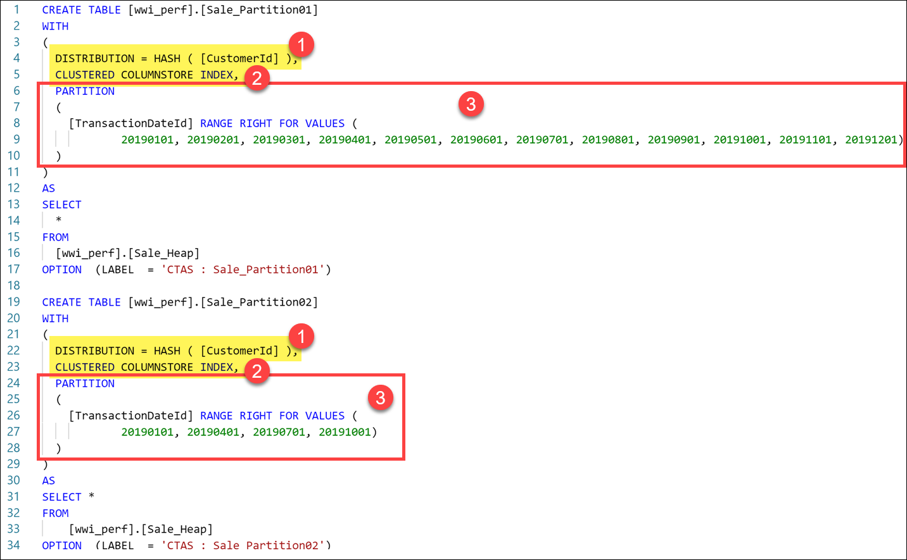

#### Table distributions

As you can see, the two partitioned tables are hash-distributed **(1)**. A distributed table appears as a single table, but the rows are actually stored across 60 distributions. The rows are distributed with a hash or round-robin algorithm.

The types of distributions are:

- **Round-robin distributed**: Distributes table rows evenly across all distributions at random.
- **Hash distributed**: Distributes table rows across the Compute nodes by using a deterministic hash function to assign each row to one distribution.
- **Replicated**: Full copy of table accessible on each Compute node.

A hash-distributed table distributes table rows across the Compute nodes by using a deterministic hash function to assign each row to one distribution.

Since identical values always hash to the same distribution, the data warehouse has built-in knowledge of the row locations.

Azure Synapse Analytics uses this knowledge to minimize data movement during queries, which improves query performance. Hash-distributed tables work well for large fact tables in a star schema. They can have very large numbers of rows and still achieve high performance. There are, of course, some design considerations that help you to get the performance the distributed system is designed to provide.

*Consider using a hash-distributed table when:*

- The table size on disk is more than 2 GB.
- The table has frequent insert, update, and delete operations.

#### Indexes

Looking at the query, also notice that both partitioned tables are configured with a **clustered columnstore index (2)**. There are different types of indexes you can use in Azure Synapse Analytics:

- **Clustered Columnstore index (Default Primary)**: Offers the highest level of data compression and best overall query performance.
- **Clustered index (Primary)**: Is performant for looking up a single to few rows.
- **Heap (Primary)**: Benefits from faster loading and landing temporary data. It is best for small lookup tables.
- **Nonclustered indexes (Secondary)**: Enable ordering of multiple columns in a table and allows multiple nonclustered on a single table. These can be created on any of the above primary indexes and offer more performant lookup queries.

By default, Azure Synapse Analytics creates a clustered columnstore index when no index options are specified on a table. Clustered columnstore tables offer both the highest level of data compression as well as the best overall query performance. They will generally outperform clustered index or heap tables and are usually the best choice for large tables. For these reasons, clustered columnstore is the best place to start when you are unsure of how to index your table.

There are a few scenarios where clustered columnstore may not be a good option:

- Columnstore tables do not support `varchar(max)`, `nvarchar(max)`, and `varbinary(max)`. Consider heap or clustered index instead.
- Columnstore tables may be less efficient for transient data. Consider heap and perhaps even temporary tables.
- Small tables with less than 100 million rows. Consider heap tables.

#### Partitioning

Again, with this query, we partition the two tables differently **(3)** so we can evaluate the performance difference and decide which partitioning strategy is best long-term. The one we ultimately go with depends on various factors with Tailwind Trader's data. You may decide to keep both to optimize query performance, but then you double the data storage and maintenance requirements for managing the data.

Partitioning is supported on all table types.

The **RANGE RIGHT** option that we use in the query **(3)** is used for time partitions. RANGE LEFT is used for number partitions.

The primary benefits to partitioning is that it:

- Improves efficiency and performance of loading and querying by limiting the scope to a subset of data.
- Offers significant query performance enhancements where filtering on the partition key can eliminate unnecessary scans and eliminate I/O (input/output operations).

The reason we have created two tables with different partition strategies **(3)** is to experiment with proper sizing.

While partitioning can be used to improve performance, creating a table with too many partitions can hurt performance under some circumstances. These concerns are especially true for clustered columnstore tables, like we created here. For partitioning to be helpful, it is important to understand when to use partitioning and the number of partitions to create. There is no hard fast rule as to how many partitions are too many, it depends on your data and how many partitions you loading simultaneously. A successful partitioning scheme usually has tens to hundreds of partitions, not thousands.

*Supplemental information*:

When creating partitions on clustered columnstore tables, it is important to consider how many rows belong to each partition. For optimal compression and performance of clustered columnstore tables, a minimum of 1 million rows per distribution and partition is needed. Before partitions are created, Azure Synapse Analytics already divides each table into 60 distributed databases. Any partitioning added to a table is in addition to the distributions created behind the scenes. Using this example, if the sales fact table contained 36 monthly partitions, and given that Azure Synapse Analytics has 60 distributions, then the sales fact table should contain 60 million rows per month, or 2.1 billion rows when all months are populated. If a table contains fewer than the recommended minimum number of rows per partition, consider using fewer partitions in order to increase the number of rows per partition.

### Use result set caching

Tailwind Trader's downstream reports are used by many users, which often means the same query is being executed repeatedly against data that does not change that often. What can they do to improve the performance of these types of queries? How does this approach work when the underlying data changes?

They should consider result-set caching.

Cache the results of a query in the provisioned Azure Synapse SQL pool storage. This enables interactive response times for repetitive queries against tables with infrequent data changes.

> The result-set cache persists even if SQL pool is paused and resumed later.

Query cache is invalidated and refreshed when the underlying table data or query code changes.

Result cache is evicted regularly based on a time-aware least recently used algorithm (TLRU).

1. In the query window, replace the script with the following to check if result set caching is on in the current SQL pool:

    ```sql
    SELECT
        name
        ,is_result_set_caching_on
    FROM
        sys.databases
    ```

2. Select **Run** from the toolbar menu to execute the SQL command.

    

    Look at the output of the query. What is the `is_result_set_caching_on` value for **SQLPool01**? In our case, it is set to `False`, meaning result set caching is currently disabled.

    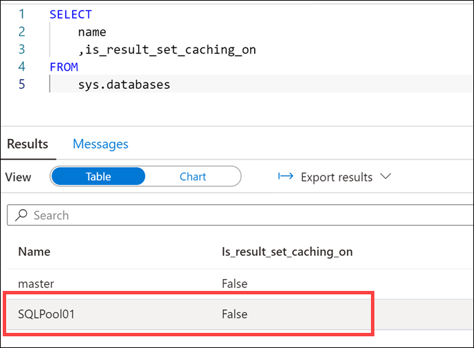

3. In the query window, change the database to **master (1)**, then replace the script **(2)** with the following to activate result set caching:

    ```sql
    ALTER DATABASE SQLPool01
    SET RESULT_SET_CACHING ON
    ```

    

4. Select **Run** from the toolbar menu to execute the SQL command.

    

    > **Important**
    >
    > The operations to create a result set cache and retrieve data from the cache happen on the control node of a Synapse SQL pool instance. When result set caching is turned ON, running queries that return a large result set (for example, >1GB) can cause high throttling on the control node and slow down the overall query response on the instance. Those queries are commonly used during data exploration or ETL operations. To avoid stressing the control node and cause performance issue, users should turn OFF result set caching on the database before running those types of queries.

5. In the toolbar menu, connect to the **SQL Pool** database for the next query.

    

6. In the query window, replace the script with the following query and immediately check if it hit the cache:

    ```sql
    SELECT
        D.Year
        ,D.Quarter
        ,D.Month
        ,SUM(S.TotalAmount) as TotalAmount
        ,SUM(S.ProfitAmount) as TotalProfit
    FROM
        [wwi_perf].[Sale_Partition02] S
        join [wwi].[Date] D on
            S.TransactionDateId = D.DateId
    GROUP BY
        D.Year
        ,D.Quarter
        ,D.Month
    OPTION (LABEL = 'Lab03: Result set caching')

    SELECT
        result_cache_hit
    FROM
        sys.dm_pdw_exec_requests
    WHERE
        request_id =
        (
            SELECT TOP 1
                request_id
            FROM
                sys.dm_pdw_exec_requests
            WHERE
                [label] = 'Lab03: Result set caching'
            ORDER BY
                start_time desc
        )
    ```

7. Select **Run** from the toolbar menu to execute the SQL command.

    

    As expected, the result is **`False` (0)**.

    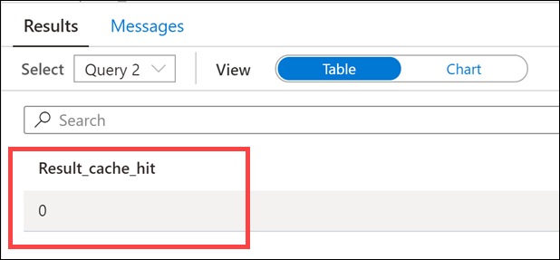

    Still, you can identify that, while running the query, Synapse has also cached the result set.

8. In the query window, replace the script with the following to get the execution steps:

    ```sql
    SELECT
        step_index
        ,operation_type
        ,location_type
        ,status
        ,total_elapsed_time
        ,command
    FROM
        sys.dm_pdw_request_steps
    WHERE
        request_id =
        (
            SELECT TOP 1
                request_id
            FROM
                sys.dm_pdw_exec_requests
            WHERE
                [label] = 'Lab03: Result set caching'
            ORDER BY
                start_time desc
        )
    ```

9. Select **Run** from the toolbar menu to execute the SQL command.

    

    The execution plan reveals the building of the result set cache:

    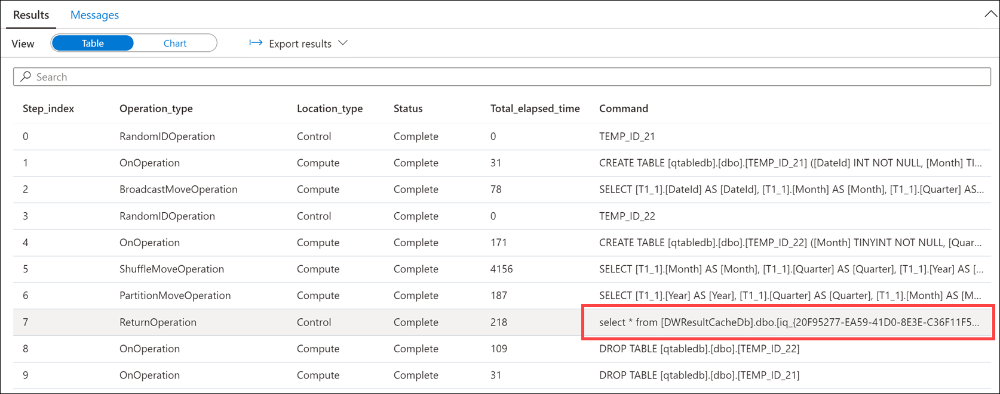

    You can control at the user session level the use of the result set cache.

10. In the query window, replace the script with the following to deactivate and activate the result cache:

    ```sql  
    SET RESULT_SET_CACHING OFF

    SELECT
        D.Year
        ,D.Quarter
        ,D.Month
        ,SUM(S.TotalAmount) as TotalAmount
        ,SUM(S.ProfitAmount) as TotalProfit
    FROM
        [wwi_perf].[Sale_Partition02] S
        join [wwi].[Date] D on
            S.TransactionDateId = D.DateId
    GROUP BY
        D.Year
        ,D.Quarter
        ,D.Month
    OPTION (LABEL = 'Lab03: Result set caching off')

    SET RESULT_SET_CACHING ON

    SELECT
        D.Year
        ,D.Quarter
        ,D.Month
        ,SUM(S.TotalAmount) as TotalAmount
        ,SUM(S.ProfitAmount) as TotalProfit
    FROM
        [wwi_perf].[Sale_Partition02] S
        join [wwi].[Date] D on
            S.TransactionDateId = D.DateId
    GROUP BY
        D.Year
        ,D.Quarter
        ,D.Month
    OPTION (LABEL = 'Lab03: Result set caching on')

    SELECT TOP 2
        request_id
        ,[label]
        ,result_cache_hit
    FROM
        sys.dm_pdw_exec_requests
    WHERE
        [label] in ('Lab03: Result set caching off', 'Lab03: Result set caching on')
    ORDER BY
        start_time desc
    ```

11. Select **Run** from the toolbar menu to execute the SQL command.

    

    The result of **`SET RESULT_SET_CACHING OFF`** in the script above is visible in the cache hit test results (The `result_cache_hit` column returns `1` for cache hit, `0` for cache miss, and *negative values* for reasons why result set caching was not used.):

    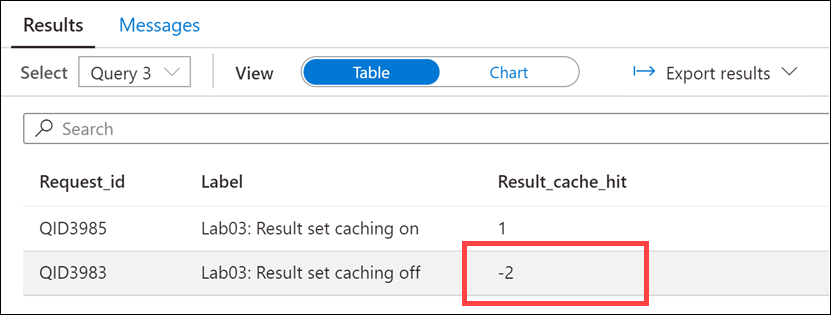

12. In the query window, replace the script with the following to check the space used by the result cache:

    ```sql
    DBCC SHOWRESULTCACHESPACEUSED
    ```

13. Select **Run** from the toolbar menu to execute the SQL command.

    

    We can see the amount of space reserved, how much is used by data, the amount used for the index, and how much unused space there is for the result cache in the query results.

    

14. In the query window, replace the script with the following to clear the result set cache:

    ```sql
    DBCC DROPRESULTSETCACHE
    ```

15. Select **Run** from the toolbar menu to execute the SQL command.

    

16. In the query window, change the database to **master (1)**, then replace the script **(2)** with the following to disable result set caching:

    ```sql
    ALTER DATABASE SQLPool01
    SET RESULT_SET_CACHING OFF
    ```

    

17. Select **Run** from the toolbar menu to execute the SQL command.

    

    > **Note to presenter**
    >
    > Make sure you disable result set caching on the SQL pool. Failing to do so will have a negative impact on the remainder of the demos, as it will skew execution times and defeat the purpose of several upcoming exercises.

    The maximum size of result set cache is 1 TB per database. The cached results are automatically invalidated when the underlying query data change.

    The cache eviction is managed by SQL Analytics automatically following this schedule:

    - Every 48 hours if the result set hasn't been used or has been invalidated.
    - When the result set cache approaches the maximum size.

    Users can manually empty the entire result set cache by using one of these options:

    - Turn OFF the result set cache feature for the database
    - Run DBCC DROPRESULTSETCACHE while connected to the database

    Pausing a database won't empty cached result set.
