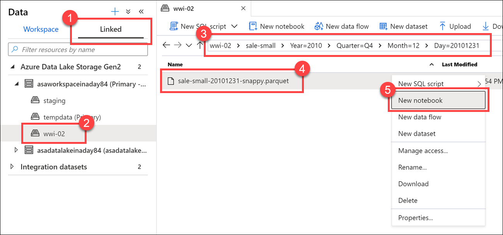
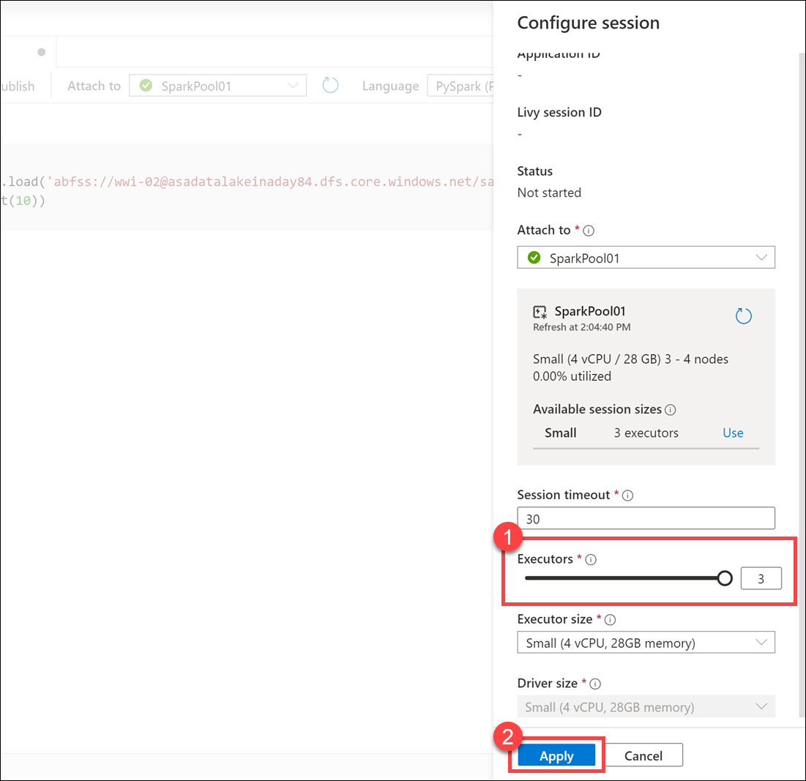
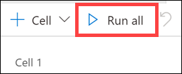
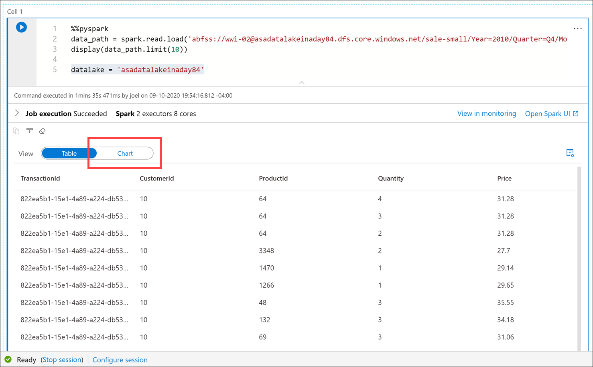

# Perform Data Engineering with Azure Synapse Spark Pools

In this demo, we show how Synapse Analytics enables you to perform data engineering tasks using the power of Apache Spark. The following table of contents describes and links to the elements of the demo:

- [Perform Data Engineering with Azure Synapse Spark Pools](#perform-data-engineering-with-azure-synapse-spark-pools)
  - [Ingesting data with Apache Spark notebooks in Azure Synapse Analytics](#ingesting-data-with-apache-spark-notebooks-in-azure-synapse-analytics)
  - [Transforming data with DataFrames in Spark Pools in Azure Synapse Analytics](#transforming-data-with-dataframes-in-spark-pools-in-azure-synapse-analytics)
  - [Integrating SQL and Spark pools in Azure Synapse Analytics](#integrating-sql-and-spark-pools-in-azure-synapse-analytics)

Tailwind Traders has unstructured and semi-structured files from various data sources. Their data engineers want to use their Spark expertise to explore, ingest, and transform these files.

You recommend using Synapse Notebooks, which are integrated in the Synapse Analytics workspace and used from within Synapse Studio.

## Ingesting data with Apache Spark notebooks in Azure Synapse Analytics

Tailwind Traders has Parquet files stored in their data lake. They want to know how they can quickly access the files and explore them using Apache Spark.

You recommend using the Data hub to view the Parquet files in the connected storage account, then use the _new notebook_ context menu to create a new Synapse Notebook that loads a Spark dataframe with the contents of a selected Parquet file.

1. Open Synapse Studio (<https://web.azuresynapse.net/>).

2. Select the **Data** hub.

    

3. Select the **Linked** tab **(1)** and expand the primary data lake storage account. Select the **wwi-02** container **(2)** and browser to the `sale-small/Year=2010/Quarter=Q4/Month=12/Day=20101231` folder **(3)**. Right-click the Parquet file **(4)** and select **New notebook (5)**.

    

    This generates a notebook with PySpark code to load the data in a Spark dataframe and display 100 rows with the header.

4. Make sure the Spark pool is attached to the notebook.

    

    The Spark pool provides the compute for all notebook operations. If we look at the bottom of the notebook, we'll see that the pool has not started. When you run a cell in the notebook while the pool is idle, the pool will start and allocate resources. This is a one-time operation until the pool auto-pauses from being idle for too long.

    

    > The auto-pause settings are configured on the Spark pool configuration in the Manage hub.

    We can change the Spark configuration for this session by selecting **Configure session**. Let's do that now.

5. Select **Configure session** at the bottom-left of the notebook.

    

6. Set the number of **Executors** to **3 (1)**, then select **Apply (2)**.

    

    We have just set the number of executors allocated to **SparkPool01** for the session.

7. Select **Run all** on the notebook toolbar to execute the notebook.

    

    > **Note:** The first time you run a notebook in a Spark pool, Synapse creates a new session. This can take approximately 3-5 minutes.

    > **Note:** To run just the cell, either hover over the cell and select the _Run cell_ icon to the left of the cell, or select the cell then type **Ctrl+Enter** on your keyboard.

8. After the cell run is complete, change the View to **Chart** in the cell output.

    

    By default, the cell outputs to a table view when we use the `display()` function. We see in the output the sales transaction data stored in the Parquet file for December 31, 2010. Let's select the **Chart** visualization to see a different view of the data.

9. Select the **View options** button to the right.

    

10. Set Key to **`ProductId`** and Values to **`TotalAmount` (1)**, then select **Apply**.

    

11. The chart visualization is displayed. Hover over the bars to view details.

    

12. Create a new cell underneath by selecting **{} Add code** when hovering over the blank space at the bottom of the notebook.

    

13. The Spark engine can analyze the Parquet files and infer the schema. To do this, enter the following in the new cell and **run** it:

    ```python
    data_path.printSchema()
    ```

    Your output should look like the following:

    ```text
    root
        |-- TransactionId: string (nullable = true)
        |-- CustomerId: integer (nullable = true)
        |-- ProductId: short (nullable = true)
        |-- Quantity: short (nullable = true)
        |-- Price: decimal(29,2) (nullable = true)
        |-- TotalAmount: decimal(29,2) (nullable = true)
        |-- TransactionDate: integer (nullable = true)
        |-- ProfitAmount: decimal(29,2) (nullable = true)
        |-- Hour: byte (nullable = true)
        |-- Minute: byte (nullable = true)
        |-- StoreId: short (nullable = true)
    ```

    Spark evaluates the file contents to infer the schema. This automatic inference is usually sufficient for data exploration and most transformation tasks. However, when you load data to an external resource like a SQL pool table, sometimes you need to declare your own schema and apply that to the dataset. For now, the schema looks good.

14. Now let's use the dataframe to use aggregates and grouping operations to better understand the data. Create a new cell and enter the following, then **run** the cell:

    ```python
    from pyspark.sql import SparkSession
    from pyspark.sql.types import *
    from pyspark.sql.functions import *

    profitByDateProduct = (data_path.groupBy("TransactionDate","ProductId")
        .agg(
            sum("ProfitAmount").alias("(sum)ProfitAmount"),
            round(avg("Quantity"), 4).alias("(avg)Quantity"),
            sum("Quantity").alias("(sum)Quantity"))
        .orderBy("TransactionDate"))
    display(profitByDateProduct.limit(100))
    ```

    > We import required Python libraries to use aggregation functions and types defined in the schema to successfully execute the query.

    The output shows the same data we saw in the chart above, but now with `sum` and `avg` aggregates **(1)**. Notice that we use the **`alias`** method **(2)** to change the column names.

    

## Transforming data with DataFrames in Spark Pools in Azure Synapse Analytics


## Integrating SQL and Spark pools in Azure Synapse Analytics
