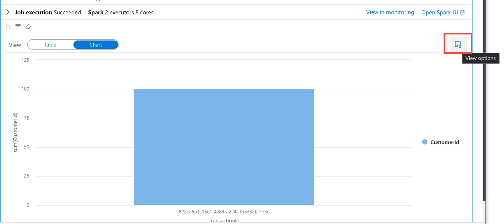
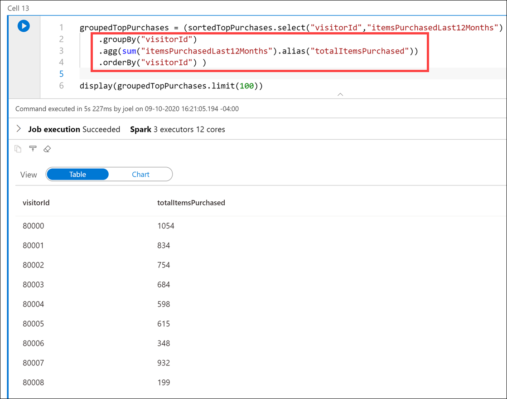
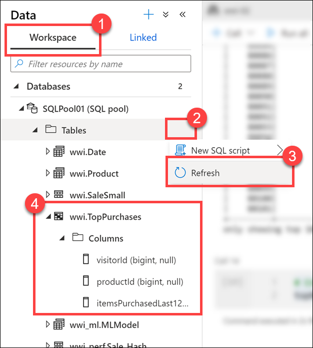
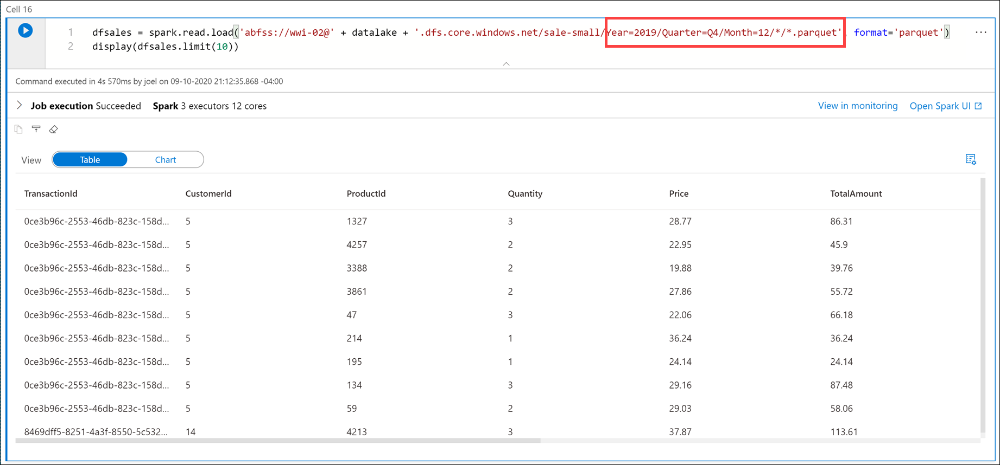

# Perform Data Engineering with Azure Synapse Spark Pools

In this demo, we show how Synapse Analytics enables you to perform data engineering tasks using the power of Apache Spark. The following table of contents describes and links to the elements of the demo:

- [Perform Data Engineering with Azure Synapse Spark Pools](#perform-data-engineering-with-azure-synapse-spark-pools)
  - [Demo prerequisites](#demo-prerequisites)
  - [Ingesting data with Apache Spark notebooks in Azure Synapse Analytics](#ingesting-data-with-apache-spark-notebooks-in-azure-synapse-analytics)
    - [Ingest and explore Parquet files from a data lake with Synapse Spark](#ingest-and-explore-parquet-files-from-a-data-lake-with-synapse-spark)
  - [Transforming data with DataFrames in Spark Pools in Azure Synapse Analytics](#transforming-data-with-dataframes-in-spark-pools-in-azure-synapse-analytics)
    - [Query and transform JSON data with Synapse Spark](#query-and-transform-json-data-with-synapse-spark)
  - [Integrating SQL and Spark pools in Azure Synapse Analytics](#integrating-sql-and-spark-pools-in-azure-synapse-analytics)

Tailwind Traders has unstructured and semi-structured files from various data sources. Their data engineers want to use their Spark expertise to explore, ingest, and transform these files.

You recommend using Synapse Notebooks, which are integrated in the Synapse Analytics workspace and used from within Synapse Studio.

## Demo prerequisites

All demos use the same environment. If you have not done so already, Complete the [environment setup instructions](https://github.com/solliancenet/synapse-in-a-day-deployment) (external link).

## Ingesting data with Apache Spark notebooks in Azure Synapse Analytics

### Ingest and explore Parquet files from a data lake with Synapse Spark

Tailwind Traders has Parquet files stored in their data lake. They want to know how they can quickly access the files and explore them using Apache Spark.

You recommend using the Data hub to view the Parquet files in the connected storage account, then use the _new notebook_ context menu to create a new Synapse Notebook that loads a Spark dataframe with the contents of a selected Parquet file.

1. Open Synapse Studio (<https://web.azuresynapse.net/>).

2. Select the **Data** hub.

    

3. Select the **Linked** tab **(1)** and expand the primary data lake storage account (*the name may differ from what you see here; it is the first storage account listed*). Select the **wwi-02** container **(2)** and browser to the `sale-small/Year=2010/Quarter=Q4/Month=12/Day=20101231` folder **(3)**. Right-click the Parquet file **(4)** and select **New notebook (5)**.

    

    This generates a notebook with PySpark code to load the data in a Spark dataframe and display 100 rows with the header.

4. Make sure the Spark pool is attached to the notebook.

    

    The Spark pool provides the compute for all notebook operations. If we look at the bottom of the notebook, we'll see that the pool has not started. When you run a cell in the notebook while the pool is idle, the pool will start and allocate resources. This is a one-time operation until the pool auto-pauses from being idle for too long.

    

    > The auto-pause settings are configured on the Spark pool configuration in the Manage hub.

    We can change the Spark configuration for this session by selecting **Configure session**. Let's do that now.

5. Select **Configure session** at the bottom-left of the notebook.

    

6. Set the number of **Executors** to **3 (1)**, then select **Apply (2)**.

    

    We have just set the number of executors allocated to **SparkPool01** for the session.

7. Add the following beneath the code in the cell to define a variable named `datalake` whose value is the name of the primary storage account (**replace the REPLACE_WITH_YOUR_DATALAKE_NAME value with the name of the storage account in line 2**):

    ```python
    datalake = 'REPLACE_WITH_YOUR_DATALAKE_NAME'
    ```

    

    This variable will be used in a couple cells later on.

8. Select **Run all** on the notebook toolbar to execute the notebook.

    

    > **Note:** The first time you run a notebook in a Spark pool, Synapse creates a new session. This can take approximately 3-5 minutes.

    > **Note:** To run just the cell, either hover over the cell and select the _Run cell_ icon to the left of the cell, or select the cell then type **Ctrl+Enter** on your keyboard.

9. After the cell run is complete, change the View to **Chart** in the cell output.

    

    By default, the cell outputs to a table view when we use the `display()` function. We see in the output the sales transaction data stored in the Parquet file for December 31, 2010. Let's select the **Chart** visualization to see a different view of the data.

10. Select the **View options** button to the right.

    

11. Set Key to **`ProductId`** and Values to **`TotalAmount` (1)**, then select **Apply**.

    

12. The chart visualization is displayed. Hover over the bars to view details.

    

13. Create a new cell underneath by selecting **{} Add code** when hovering over the blank space at the bottom of the notebook.

    

14. The Spark engine can analyze the Parquet files and infer the schema. To do this, enter the following in the new cell and **run** it:

    ```python
    data_path.printSchema()
    ```

    Your output should look like the following:

    ```text
    root
        |-- TransactionId: string (nullable = true)
        |-- CustomerId: integer (nullable = true)
        |-- ProductId: short (nullable = true)
        |-- Quantity: short (nullable = true)
        |-- Price: decimal(29,2) (nullable = true)
        |-- TotalAmount: decimal(29,2) (nullable = true)
        |-- TransactionDate: integer (nullable = true)
        |-- ProfitAmount: decimal(29,2) (nullable = true)
        |-- Hour: byte (nullable = true)
        |-- Minute: byte (nullable = true)
        |-- StoreId: short (nullable = true)
    ```

    Spark evaluates the file contents to infer the schema. This automatic inference is usually sufficient for data exploration and most transformation tasks. However, when you load data to an external resource like a SQL pool table, sometimes you need to declare your own schema and apply that to the dataset. For now, the schema looks good.

15. Now let's use the dataframe to use aggregates and grouping operations to better understand the data. Create a new cell and enter the following, then **run** the cell:

    ```python
    from pyspark.sql import SparkSession
    from pyspark.sql.types import *
    from pyspark.sql.functions import *

    profitByDateProduct = (data_path.groupBy("TransactionDate","ProductId")
        .agg(
            sum("ProfitAmount").alias("(sum)ProfitAmount"),
            round(avg("Quantity"), 4).alias("(avg)Quantity"),
            sum("Quantity").alias("(sum)Quantity"))
        .orderBy("TransactionDate"))
    display(profitByDateProduct.limit(100))
    ```

    > We import required Python libraries to use aggregation functions and types defined in the schema to successfully execute the query.

    The output shows the same data we saw in the chart above, but now with `sum` and `avg` aggregates **(1)**. Notice that we use the **`alias`** method **(2)** to change the column names.

    

## Transforming data with DataFrames in Spark Pools in Azure Synapse Analytics

### Query and transform JSON data with Synapse Spark

In addition to the sales data, Tailwind Traders has customer profile data from an e-commerce system that provides top product purchases for each visitor of the site (customer) over the past 12 months. This data is stored within JSON files in the data lake. They have struggled with ingesting, exploring, and transforming these JSON files and want your guidance. The files have a hierarchical structure that they want to flatten before loading into relational data stores. They also wish to apply grouping and aggregate operations as part of the data engineering process.

You recommend using Synapse Notebooks to explore and apply data transformations on the JSON files.

1. Create a new cell in the Spark notebook, enter the following code and execute the cell:

    ```python
    df = (spark.read \
            .option('inferSchema', 'true') \
            .json('abfss://wwi-02@' + datalake + '.dfs.core.windows.net/online-user-profiles-02/*.json', multiLine=True)
        )

    df.printSchema()
    ```

    > The `datalake` variable we created in the first cell is used here as part of the file path.

    Your output should look like the following:

    ```text
    root
    |-- topProductPurchases: array (nullable = true)
    |    |-- element: struct (containsNull = true)
    |    |    |-- itemsPurchasedLast12Months: long (nullable = true)
    |    |    |-- productId: long (nullable = true)
    |-- visitorId: long (nullable = true)
    ```

    > Notice that we are selecting all JSON files within the `online-user-profiles-02` directory. Each JSON file contains several rows, which is why we specified the `multiLine=True` option. Also, we set the `inferSchema` option to `true`, which instructs the Spark engine to review the files and create a schema based on the nature of the data.

2. We have been using Python code in these cells up to this point. If we want to query the files using SQL syntax, one option is to create a temporary view of the data within the dataframe. Execute the following in a new cell to create a view named `user_profiles`:

    ```python
    # create a view called user_profiles
    df.createOrReplaceTempView("user_profiles")
    ```

3. Create a new cell. Since we want to use SQL instead of Python, we use the `%%sql` magic to set the language of the cell to SQL. Execute the following code in the cell:

    ```sql
    %%sql

    SELECT * FROM user_profiles LIMIT 10
    ```

    Notice that the output shows nested data for `topProductPurchases`, which includes an array of `productId` and `itemsPurchasedLast12Months` values. You can expand the fields by clicking the right triangle in each row.

    

    This makes analyzing the data a bit difficult. This is because the JSON file contents look like the following:

    ```json
    [
    {
        "visitorId": 9529082,
        "topProductPurchases": [
        {
            "productId": 4679,
            "itemsPurchasedLast12Months": 26
        },
        {
            "productId": 1779,
            "itemsPurchasedLast12Months": 32
        },
        {
            "productId": 2125,
            "itemsPurchasedLast12Months": 75
        },
        {
            "productId": 2007,
            "itemsPurchasedLast12Months": 39
        },
        {
            "productId": 1240,
            "itemsPurchasedLast12Months": 31
        },
        {
            "productId": 446,
            "itemsPurchasedLast12Months": 39
        },
        {
            "productId": 3110,
            "itemsPurchasedLast12Months": 40
        },
        {
            "productId": 52,
            "itemsPurchasedLast12Months": 2
        },
        {
            "productId": 978,
            "itemsPurchasedLast12Months": 81
        },
        {
            "productId": 1219,
            "itemsPurchasedLast12Months": 56
        },
        {
            "productId": 2982,
            "itemsPurchasedLast12Months": 59
        }
        ]
    },
    {
        ...
    },
    {
        ...
    }
    ]
    ```

4. PySpark contains a special [`explode` function](https://spark.apache.org/docs/latest/api/python/pyspark.sql.html?highlight=explode#pyspark.sql.functions.explode), which returns a new row for each element of the array. This will help flatten the `topProductPurchases` column for better readability or for easier querying. Execute the following in a new cell:

    ```python
    from pyspark.sql.functions import udf, explode

    flat=df.select('visitorId',explode('topProductPurchases').alias('topProductPurchases_flat'))
    flat.show(100)
    ```

    In this cell, we created a new dataframe named `flat` that includes the `visitorId` field and a new aliased field named `topProductPurchases_flat`. As you can see, the output is a bit easier to read and, by extension, easier to query.

    

5. Create a new cell and execute the following code to create a new flattened version of the dataframe that extracts the `topProductPurchases_flat.productId` and `topProductPurchases_flat.itemsPurchasedLast12Months` fields to create new rows for each data combination:

    ```python
    topPurchases = (flat.select('visitorId','topProductPurchases_flat.productId','topProductPurchases_flat.itemsPurchasedLast12Months')
        .orderBy('visitorId'))

    topPurchases.show(100)
    ```

    In the output, notice that we now have multiple rows for each `visitorId`.

    

6. Let's order the rows by the number of items purchased in the last 12 months. Create a new cell and execute the following code:

    ```python
    # Let's order by the number of items purchased in the last 12 months
    sortedTopPurchases = topPurchases.orderBy("itemsPurchasedLast12Months")

    display(sortedTopPurchases.limit(100))
    ```

    

7. How do we sort in reverse order? One might conclude that we could make a call like this: `topPurchases.orderBy("itemsPurchasedLast12Months desc")`. Try it in a new cell:

    ```python
    topPurchases.orderBy("itemsPurchasedLast12Months desc")
    ```

    

    Notice that there is an `AnalysisException` error, because `itemsPurchasedLast12Months desc` does not match up with a column name.

    Why does this not work?

    - The `DataFrames` API is built upon an SQL engine.
    - There is a lot of familiarity with this API and SQL syntax in general.
    - The problem is that `orderBy(..)` expects the name of the column.
    - What we specified was an SQL expression in the form of **requests desc**.
    - What we need is a way to programmatically express such an expression.
    - This leads us to the second variant, `orderBy(Column)` and more specifically, the class `Column`.

8. The **Column** class is an object that encompasses more than just the name of the column, but also column-level-transformations, such as sorting in a descending order. Execute the following code in a new cell:

    ```python
    sortedTopPurchases = (topPurchases
        .orderBy( col("itemsPurchasedLast12Months").desc() ))

    display(sortedTopPurchases.limit(100))
    ```

    Notice that the results are now sorted by the `itemsPurchasedLast12Months` column in descending order, thanks to the **`desc()`** method on the **`col`** object.

    

9. How many *types* of products did each customer purchase? To figure this out, we need to group by `visitorId` and aggregate on the number of rows per customer. Execute the following code in a new cell:

    ```python
    groupedTopPurchases = (sortedTopPurchases.select("visitorId")
        .groupBy("visitorId")
        .agg(count("*").alias("total"))
        .orderBy("visitorId") )

    display(groupedTopPurchases.limit(100))
    ```

    Notice how we use the **`groupBy`** method on the `visitorId` column, and the **`agg`** method over a count of records to display the total for each customer.

    

10. How many *total items* did each customer purchase? To figure this out, we need to group by `visitorId` and aggregate on the sum of `itemsPurchasedLast12Months` values per customer. Execute the following code in a new cell:

    ```python
    groupedTopPurchases = (sortedTopPurchases.select("visitorId","itemsPurchasedLast12Months")
        .groupBy("visitorId")
        .agg(sum("itemsPurchasedLast12Months").alias("totalItemsPurchased"))
        .orderBy("visitorId") )

    groupedTopPurchases.show(100)
    ```

    Here we group by `visitorId` once again, but now we use a **`sum`** over the `itemsPurchasedLast12Months` column in the **`agg`** method. Notice that we included the `itemsPurchasedLast12Months` column in the `select` statement so we could use it in the `sum`.

    

## Integrating SQL and Spark pools in Azure Synapse Analytics

Tailwind Traders wants to write to the SQL pool after performing data engineering tasks in Spark, then reference the SQL pool data as a source for joining with Spark dataframes that contain data from other files.

You decide to use the Azure Synapse Apache Spark to Synapse SQL connector to efficiently transfer data between Spark pools and SQL pools in Azure Synapse.

Transferring data between Spark pools and SQL pools can be done using JDBC. However, given two distributed systems such as Spark and SQL pools, JDBC tends to be a bottleneck with serial data transfer.

The Azure Synapse Apache Spark pool to Synapse SQL connector is a data source implementation for Apache Spark. It uses the Azure Data Lake Storage Gen2 and PolyBase in SQL pools to efficiently transfer data between the Spark cluster and the Synapse SQL instance.

1. We have been using Python code in these cells up to this point. If we want to use the Apache Spark pool to Synapse SQL connector (`sqlanalytics`), one option is to create a temporary view of the data within the dataframe. Execute the following in a new cell to create a view named `top_purchases`:

    ```python
    # Create a temporary view for top purchases so we can load from Scala
    topPurchases.createOrReplaceTempView("top_purchases")
    ```

    We created a new temporary view from the `topPurchases` dataframe that we created earlier and which contains the flattened JSON user purchases data.

2. We must execute code that uses the Apache Spark pool to Synapse SQL connector in Scala. To do this, we add the `%%spark` magic to the cell. Execute the following in a new cell to read from the `top_purchases` view:

    ```java
    %%spark
    // Make sure the name of the SQL pool (SQLPool01 below) matches the name of your SQL pool.
    val df = spark.sqlContext.sql("select * from top_purchases")
    df.write.sqlanalytics("SQLPool01.wwi.TopPurchases", Constants.INTERNAL)
    ```

    > **Note to presenter**: The cell may take over a minute to execute. If you have run this command before, you will receive an error stating that "There is already and object named.." because the table already exists.

    After the cell finishes executing, let's take a look at the list of SQL pool tables to verify that the table was successfully created for us.

3. **Leave the notebook open**, then navigate to the **Data** hub (if not already selected).

    

4. Select the **Workspace** tab **(1)**, expand the SQL pool, select the **ellipses (...)** on Tables **(2)** and select **Refresh (3)**. Expand the **`wwi.TopPurchases`** table and columns **(4)**.

    

    As you can see, the `wwi.TopPurchases` table was automatically created for us, based on the derived schema of the Spark dataframe. The Apache Spark pool to Synapse SQL connector was responsible for creating the table and efficiently loading the data into it.

5. **Return to the notebook** and execute the following in a new cell to read sales data from all the Parquet files located in the `sale-small/Year=2019/Quarter=Q4/Month=12/` folder:

    ```python
    dfsales = spark.read.load('abfss://wwi-02@' + datalake + '.dfs.core.windows.net/sale-small/Year=2019/Quarter=Q4/Month=12/*/*.parquet', format='parquet')
    display(dfsales.limit(10))
    ```

    > **Note to presenter**: It can take over 3 minutes for this cell to execute.
    >
    > The `datalake` variable we created in the first cell is used here as part of the file path.

    

    Compare the file path in the cell above to the file path in the first cell. Here we are using a relative path to load **all December 2019 sales** data from the Parquet files located in `sale-small`, vs. just December 31, 2010 sales data.

    Next, let's load the `TopSales` data from the SQL pool table we created earlier into a new Spark dataframe, then join it with this new `dfsales` dataframe. To do this, we must once again use the `%%spark` magic on a new cell since we'll use the Apache Spark pool to Synapse SQL connector to retrieve data from the SQL pool. Then we need to add the dataframe contents to a new temporary view so we can access the data from Python.

6. Execute the following in a new cell to read from the `TopSales` SQL pool table and save it to a temporary view:

    ```java
    %%spark
    // Make sure the name of the SQL pool (SQLPool01 below) matches the name of your SQL pool.
    val df2 = spark.read.sqlanalytics("SQLPool01.wwi.TopPurchases")
    df2.createTempView("top_purchases_sql")

    df2.head(10)
    ```

    

    The cell's language is set to `Scala` by using the `%%spark` magic **(1)** at the top of the cell. We declared a new variable named `df2` as a new DataFrame created by the `spark.read.sqlanalytics` method, which reads from the `TopPurchases` table **(2)** in the SQL pool. Then we populated a new temporary view named `top_purchases_sql` **(3)**. Finally, we showed the first 10 records with the `df2.head(10))` line **(4)**. The cell output displays the dataframe values **(5)**.

7. Execute the following in a new cell to create a new dataframe in Python from the `top_purchases_sql` temporary view, then display the first 10 results:

    ```python
    dfTopPurchasesFromSql = sqlContext.table("top_purchases_sql")

    display(dfTopPurchasesFromSql.limit(10))
    ```

    

8. Execute the following in a new cell to join the data from the sales Parquet files and the `TopPurchases` SQL pool:

    ```python
    inner_join = dfsales.join(dfTopPurchasesFromSql,
        (dfsales.CustomerId == dfTopPurchasesFromSql.visitorId) & (dfsales.ProductId == dfTopPurchasesFromSql.productId))

    inner_join_agg = (inner_join.select("CustomerId","TotalAmount","Quantity","itemsPurchasedLast12Months","top_purchases_sql.productId")
        .groupBy(["CustomerId","top_purchases_sql.productId"])
        .agg(
            sum("TotalAmount").alias("TotalAmountDecember"),
            sum("Quantity").alias("TotalQuantityDecember"),
            sum("itemsPurchasedLast12Months").alias("TotalItemsPurchasedLast12Months"))
        .orderBy("CustomerId") )

    display(inner_join_agg.limit(100))
    ```

    In the query, we joined the `dfsales` and `dfTopPurchasesFromSql` dataframes, matching on `CustomerId` and `ProductId`. This join combined the `TopPurchases` SQL pool table data with the December 2019 sales Parquet data **(1)**.

    We grouped by the `CustomerId` and `ProductId` fields. Since the `ProductId` field name is ambiguous (it exists in both dataframes), we had to fully-qualify the `ProductId` name to refer to the one in the `TopPurchases` dataframe **(2)**.

    Then we created an aggregate that summed the total amount spent on each product in December, the total number of product items in December, and the total product items purchased in the last 12 months **(3)**.

    Finally, we displayed the joined and aggregated data in a table view.

    > **Note to presenter**: Feel free to click on the column headers in the Table view to sort the result set.

    
