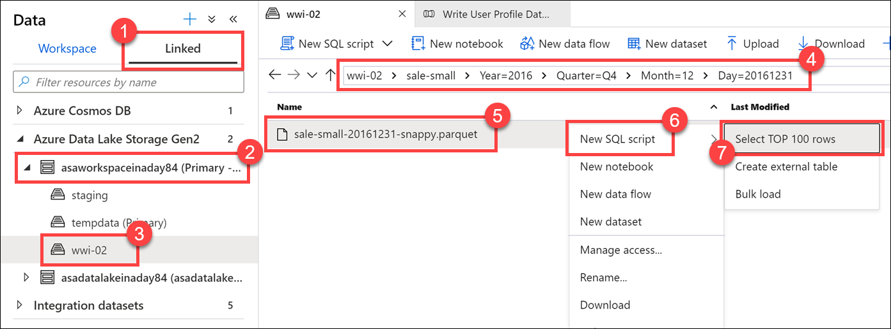
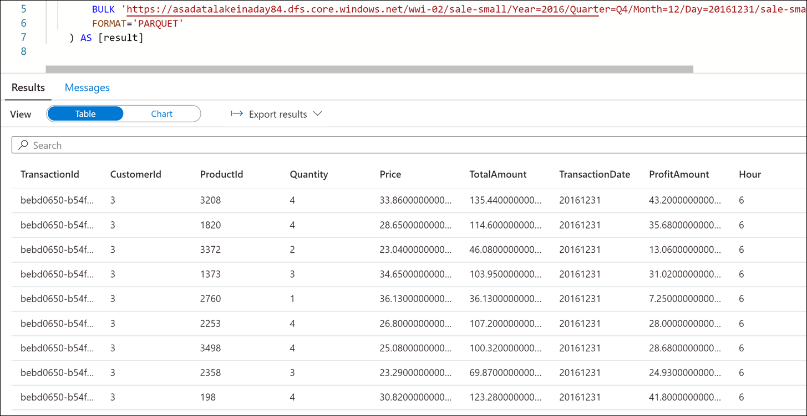
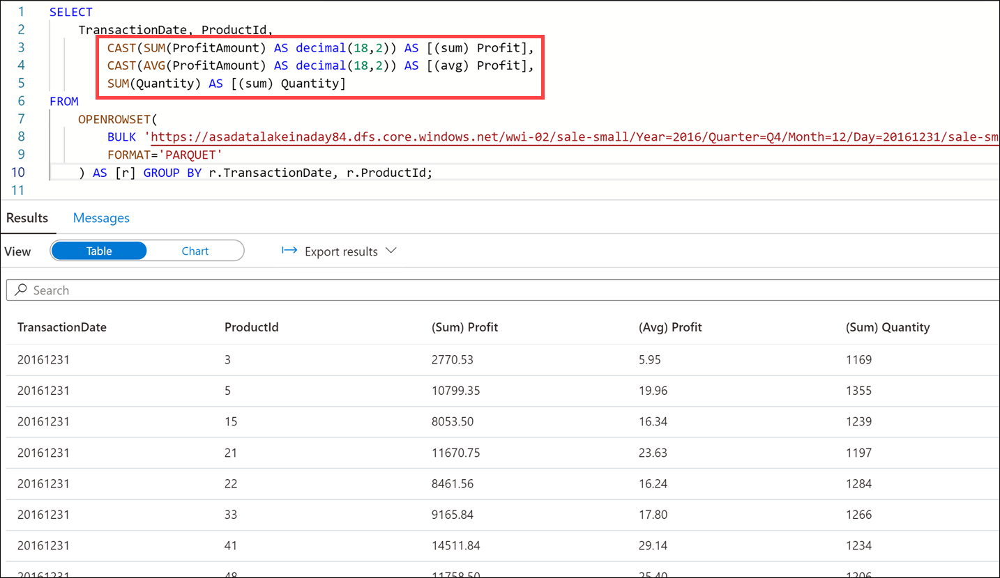

# Run interactive queries using Azure Synapse SQL Serverless

- [Run interactive queries using Azure Synapse SQL Serverless](#run-interactive-queries-using-azure-synapse-sql-serverless)
  - [Querying a Data Lake Store using SQL Serverless in Azure Synapse Analytics](#querying-a-data-lake-store-using-sql-serverless-in-azure-synapse-analytics)
    - [Task 1: Query sales Parquet data with Synapse SQL Serverless](#task-1-query-sales-parquet-data-with-synapse-sql-serverless)
  - [Securing access to data through using SQL Serverless in Azure Synapse Analytics](#securing-access-to-data-through-using-sql-serverless-in-azure-synapse-analytics)

Tailwind Trader's Data Engineers want a way to explore the data lake, transform and prepare data, and simplify their data transformation pipelines. In addition, they want their Data Analysts to explore data in the lake and Spark external tables created by Data Scientists or Data Engineers, using familiar T-SQL language or their favorite tools, which can connect to SQL endpoints.

## Querying a Data Lake Store using SQL Serverless in Azure Synapse Analytics

Understanding data through data exploration is one of the core challenges faced today by data engineers and data scientists as well. Depending on the underlying structure of the data as well as the specific requirements of the exploration process, different data processing engines will offer varying degrees of performance, complexity, and flexibility.

In Azure Synapse Analytics, you have the possibility of using either the Synapse SQL Serverless engine, the big-data Spark engine, or both.

In this exercise, you will explore the data lake using both options.

### Task 1: Query sales Parquet data with Synapse SQL Serverless

When you query Parquet files using Synapse SQL Serverless, you can explore the data with T-SQL syntax.

1. In Synapse Analytics Studio, navigate to the **Data** hub.

    

2. Select the **Linked** tab **(1)** and expand **Azure Data Lake Storage Gen2**. Expand the `asaworkspaceXX` primary ADLS Gen2 account **(2)** and select the **`wwi-02`** container **(3)**. Navigate to the `sale-small/Year=2016/Quarter=Q4/Month=12/Day=20161231` folder **(4)**. Right-click on the `sale-small-20161231-snappy.parquet` file **(5)**, select **New SQL script (6)**, then **Select TOP 100 rows (7)**.

    

3. Ensure **SQL on-demand** is selected **(1)** in the `Connect to` dropdown list above the query window, then run the query **(2)**. Data is loaded by the Synapse SQL Serverless endpoint and processed as if was coming from any regular relational database.

    

    The cell output shows the query results from the Parquet file.

    

4. Modify the SQL query to perform aggregates and grouping operations to better understand the data. Replace the query with the following, making sure that the file path in `OPENROWSET` matches the current file path:

    ```sql
    SELECT
        TransactionDate, ProductId,
            CAST(SUM(ProfitAmount) AS decimal(18,2)) AS [(sum) Profit],
            CAST(AVG(ProfitAmount) AS decimal(18,2)) AS [(avg) Profit],
            SUM(Quantity) AS [(sum) Quantity]
    FROM
        OPENROWSET(
            BULK 'https://asadatalakeSUFFIX.dfs.core.windows.net/wwi-02/sale-small/Year=2016/Quarter=Q4/Month=12/Day=20161231/sale-small-20161231-snappy.parquet',
            FORMAT='PARQUET'
        ) AS [r] GROUP BY r.TransactionDate, r.ProductId;
    ```

    

5. Now let's figure out how many records are contained within the Parquet files for 2019 data. This information is important for planning how we optimize for importing the data into Azure Synapse Analytics. To do this, we'll replace the query with the following (be sure to update the name of your data lake in BULK statement, by replacing `[asadatalakeSUFFIX]`):

    ```sql
    SELECT
        COUNT(*)
    FROM
        OPENROWSET(
            BULK 'https://asadatalakeSUFFIX.dfs.core.windows.net/wwi-02/sale-small/Year=2019/*/*/*/*',
            FORMAT='PARQUET'
        ) AS [r];
    ```

    > Notice how we updated the path to include all Parquet files in all subfolders of `sale-small/Year=2019`.

    The output should be **339507246** records.

## Securing access to data through using SQL Serverless in Azure Synapse Analytics
