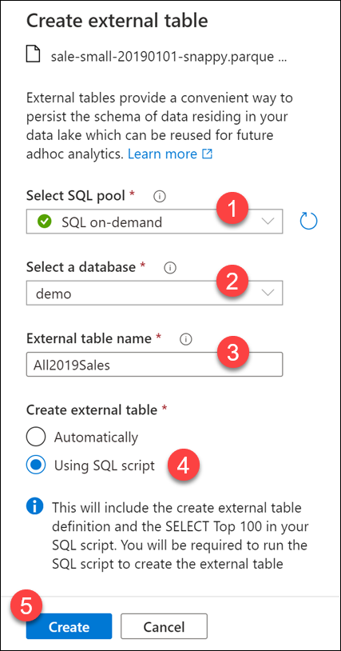
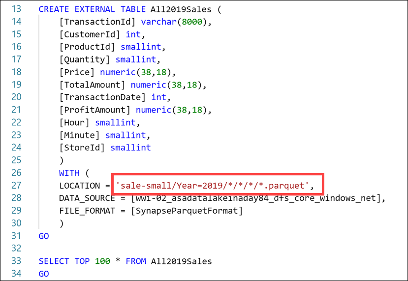
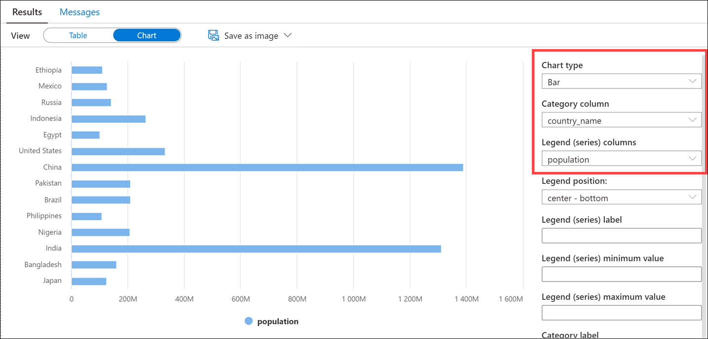
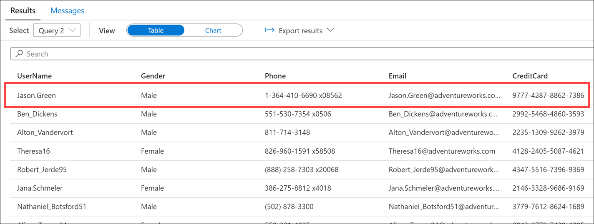
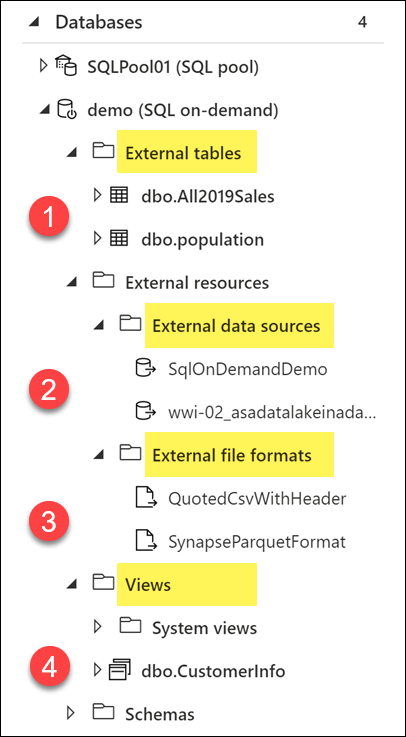

# Run interactive queries using Azure Synapse SQL Serverless

- [Run interactive queries using Azure Synapse SQL Serverless](#run-interactive-queries-using-azure-synapse-sql-serverless)
  - [Querying a Data Lake Store using SQL Serverless in Azure Synapse Analytics](#querying-a-data-lake-store-using-sql-serverless-in-azure-synapse-analytics)
    - [Query sales Parquet data with Synapse SQL Serverless](#query-sales-parquet-data-with-synapse-sql-serverless)
    - [Create an external table for 2019 sales data](#create-an-external-table-for-2019-sales-data)
    - [Create an external table for CSV files](#create-an-external-table-for-csv-files)
    - [Create a SQL serverless view](#create-a-sql-serverless-view)
  - [Securing access to data through using SQL Serverless in Azure Synapse Analytics](#securing-access-to-data-through-using-sql-serverless-in-azure-synapse-analytics)

Tailwind Trader's Data Engineers want a way to explore the data lake, transform and prepare data, and simplify their data transformation pipelines. In addition, they want their Data Analysts to explore data in the lake and Spark external tables created by Data Scientists or Data Engineers, using familiar T-SQL language or their favorite tools, which can connect to SQL endpoints.

## Querying a Data Lake Store using SQL Serverless in Azure Synapse Analytics

Understanding data through data exploration is one of the core challenges faced today by data engineers and data scientists as well. Depending on the underlying structure of the data as well as the specific requirements of the exploration process, different data processing engines will offer varying degrees of performance, complexity, and flexibility.

In Azure Synapse Analytics, you have the possibility of using either the Synapse SQL Serverless engine, the big-data Spark engine, or both.

In this exercise, you will explore the data lake using both options.

### Query sales Parquet data with Synapse SQL Serverless

When you query Parquet files using Synapse SQL Serverless, you can explore the data with T-SQL syntax.

1. In Synapse Analytics Studio, navigate to the **Data** hub.

    

2. Select the **Linked** tab **(1)** and expand **Azure Data Lake Storage Gen2**. Expand the `asaworkspaceXX` primary ADLS Gen2 account **(2)** and select the **`wwi-02`** container **(3)**. Navigate to the `sale-small/Year=2016/Quarter=Q4/Month=12/Day=20161231` folder **(4)**. Right-click on the `sale-small-20161231-snappy.parquet` file **(5)**, select **New SQL script (6)**, then **Select TOP 100 rows (7)**.

    

3. Ensure **SQL on-demand** is selected **(1)** in the `Connect to` dropdown list above the query window, then run the query **(2)**. Data is loaded by the Synapse SQL Serverless endpoint and processed as if was coming from any regular relational database.

    

    The cell output shows the query results from the Parquet file.

    

4. Modify the SQL query to perform aggregates and grouping operations to better understand the data. Replace the query with the following, making sure that the file path in `OPENROWSET` matches the current file path:

    ```sql
    SELECT
        TransactionDate, ProductId,
            CAST(SUM(ProfitAmount) AS decimal(18,2)) AS [(sum) Profit],
            CAST(AVG(ProfitAmount) AS decimal(18,2)) AS [(avg) Profit],
            SUM(Quantity) AS [(sum) Quantity]
    FROM
        OPENROWSET(
            BULK 'https://asadatalakeSUFFIX.dfs.core.windows.net/wwi-02/sale-small/Year=2016/Quarter=Q4/Month=12/Day=20161231/sale-small-20161231-snappy.parquet',
            FORMAT='PARQUET'
        ) AS [r] GROUP BY r.TransactionDate, r.ProductId;
    ```

    

5. Now let's figure out how many records are contained within the Parquet files for 2019 data. This information is important for planning how we optimize for importing the data into Azure Synapse Analytics. To do this, we'll replace the query with the following (be sure to update the name of your data lake in BULK statement, by replacing `[asadatalakeSUFFIX]`):

    ```sql
    SELECT
        COUNT(*)
    FROM
        OPENROWSET(
            BULK 'https://asadatalakeSUFFIX.dfs.core.windows.net/wwi-02/sale-small/Year=2019/*/*/*/*',
            FORMAT='PARQUET'
        ) AS [r];
    ```

    > Notice how we updated the path to include all Parquet files in all subfolders of `sale-small/Year=2019`.

    The output should be **339507246** records.

### Create an external table for 2019 sales data

Rather than creating a script with `OPENROWSET` and a path to the root 2019 folder every time we want to query the Parquet files, we can create an external table.

1. In Synapse Analytics Studio, navigate to the **Data** hub.

    

2. Select the **Linked** tab **(1)** and expand **Azure Data Lake Storage Gen2**. Expand the `asaworkspaceXX` primary ADLS Gen2 account **(2)** and select the **`wwi-02`** container **(3)**. Navigate to the `sale-small/Year=2019/Quarter=Q1/Month=1/Day=20190101` folder **(4)**. Right-click on the `sale-small-20190101-snappy.parquet` file **(5)**, select **New SQL script (6)**, then **Create external table (7)**.

    [The create external link is highlighted.](media/create-external-table.png "Create external table")

3. Make sure **`SQL on-demand`** is selected for the **SQL pool (1)**. Under **Select a database**, select **+ New** and enter `demo` **(2)**. For **External table name**, enter `All2019Sales` **(3)**. Under **Create external table**, select **Using SQL script (4)**, then select **Create (5)**.

    

    > **Note to presenter**: Make sure the script is connected to the SQL serverless pool (`SQL on-demand`) **(1)** and the database is set to `demo` **(2)**.

    

    The generated script contains the following components:

    - **1)** The script begins with creating the `SynapseParquetFormat` external file format with a `FORMAT_TYPE` of `PARQUET`.
    - **2)** Next, the external data source is created, pointing to the `wwi-02` container of the data lake storage account.
    - **3)** The CREATE EXTERNAL TABLE `WITH` statement specifies the file location and refers to the new external file format and data source created above.
    - **4)** Finally, we select the top 100 results from the `2019Sales` external table.

    

4. Replace the `LOCATION` value in the `CREATE EXTERNAL TABLE` statement with **`sale-small/Year=2019/*/*/*/*.parquet`**.

    

5. **Run** the script.

    

    After running the script, we can see the output of the SELECT query against the `All2019Sales` external table. This displays the first 100 records from the Parquet files located in the `YEAR=2019` folder.

    

### Create an external table for CSV files

Tailwind Traders found an open data source for country population data that they want to use. They do not want to merely copy the data since it is regularly updated with projected populations in future years.

You decide to create an external table that connects to the external data source.

1. Replace the SQL script with the following:

    ```sql
    IF NOT EXISTS (SELECT * FROM sys.symmetric_keys) BEGIN
        declare @pasword nvarchar(400) = CAST(newid() as VARCHAR(400));
        EXEC('CREATE MASTER KEY ENCRYPTION BY PASSWORD = ''' + @pasword + '''')
    END

    CREATE DATABASE SCOPED CREDENTIAL [sqlondemand]
    WITH IDENTITY='SHARED ACCESS SIGNATURE',  
    SECRET = 'sv=2018-03-28&ss=bf&srt=sco&sp=rl&st=2019-10-14T12%3A10%3A25Z&se=2061-12-31T12%3A10%3A00Z&sig=KlSU2ullCscyTS0An0nozEpo4tO5JAgGBvw%2FJX2lguw%3D'
    GO

    -- Create external data source secured using credential
    CREATE EXTERNAL DATA SOURCE SqlOnDemandDemo WITH (
        LOCATION = 'https://sqlondemandstorage.blob.core.windows.net',
        CREDENTIAL = sqlondemand
    );
    GO

    CREATE EXTERNAL FILE FORMAT QuotedCsvWithHeader
    WITH (  
        FORMAT_TYPE = DELIMITEDTEXT,
        FORMAT_OPTIONS (
            FIELD_TERMINATOR = ',',
            STRING_DELIMITER = '"',
            FIRST_ROW = 2
        )
    );
    GO

    CREATE EXTERNAL TABLE [population]
    (
        [country_code] VARCHAR (5) COLLATE Latin1_General_BIN2,
        [country_name] VARCHAR (100) COLLATE Latin1_General_BIN2,
        [year] smallint,
        [population] bigint
    )
    WITH (
        LOCATION = 'csv/population/population.csv',
        DATA_SOURCE = SqlOnDemandDemo,
        FILE_FORMAT = QuotedCsvWithHeader
    );
    GO
    ```

    At the top of the script, we create a `MASTER KEY` with a random password **(1)**. Next, we create a database-scoped credential for the containers in the external storage account **(2)**. This credential is used when we create the `SqlOnDemandDemo` external data source **(3)** that points to the location of the external storage account that contains the population data:

    

    In the next part of the script, we create an external file format called `QuotedCsvWithHeader`. Creating an external file format is a prerequisite for creating an External Table. By creating an External File Format, you specify the actual layout of the data referenced by an external table. Here we specify the CSV field terminator, string delimiter, and set the `FIRST_ROW` value to 2 since the file contains a header row:

    

    Finally, at the bottom of the script, we create an external table named `population`. The `WITH` clause specifies the relative location of the CSV file, points to the data source created above, as well as the `QuotedCsvWithHeader` file format:

    

2. **Run** the script.

    

3. Replace the SQL script with the following to select from the population external table, filtered by 2019 data where the population is greater than 100 million:

    ```sql
    SELECT [country_code]
        ,[country_name]
        ,[year]
        ,[population]
    FROM [dbo].[population]
    WHERE [year] = 2019 and population > 100000000
    ```

4. **Run** the script.

    

5. In the query results, select the **Chart** view, then configure it as follows:

    - **Chart type**: Select `Bar`.
    - **Category column**: Select `country_name`.
    - **Legend (series) columns**: Select `population`.
    - **Legend position**: Select `center - bottom`.

    

### Create a SQL serverless view

Let's create a view to wrap a SQL serverless query. Views allow you to reuse queries and are needed if you want to use tools, such as Power BI, in conjunction with SQL serverless.

1. In Synapse Analytics Studio, navigate to the **Data** hub.

    

2. Select the **Linked** tab **(1)** and expand **Azure Data Lake Storage Gen2**. Expand the `asaworkspaceXX` primary ADLS Gen2 account **(2)** and select the **`wwi-02`** container **(3)**. Navigate to the `customer-info` folder **(4)**. Right-click on the `customerinfo.csv` file **(5)**, select **New SQL script (6)**, then **Select TOP 100 rows (7)**.

    

3. Select **Run** to execute the script **(1)**. Notice that the first row of the CSV file is the column header row **(2)**.

    

4. Update the script with the following and **make sure you replace YOUR_DATALAKE_NAME (1)** (your primary data lake storage account) in the OPENROWSET BULK path with the value in the in the previous select statement. Set the **Use database** value to **`demo` (2)** (use the refresh button to the right if needed):

    ```sql
    CREATE VIEW CustomerInfo AS
        SELECT * 
    FROM OPENROWSET(
            BULK 'https://YOUR_DATALAKE_NAME.dfs.core.windows.net/wwi-02/customer-info/customerinfo.csv',
            FORMAT = 'CSV',
            PARSER_VERSION='2.0',
            FIRSTROW=2
        )
    WITH (
        [UserName] VARCHAR (50),
        [Gender] VARCHAR (10),
        [Phone] VARCHAR (50),
        [Email] VARCHAR (100),
        [CreditCard] VARCHAR (50)
    ) AS [r];
    GO

    SELECT * FROM CustomerInfo;
    GO
    ```

    

5. Select **Run** to execute the script.

    

    We just created the view to wrap the SQL serverless query that selects data from the CSV file and selected from the view:

    

    Notice that the first no longer contains the column headers. This is because we used the `FIRSTROW=2` setting in the `OPENROWSET` statement when we created the view.

6. Within the **Data** hub, select the **Workspace** tab **(1)**. Select the actions ellipses **(...)** to the right of the Databases group **(2)**, then select **Refresh (3)**.

    

7. Expand the `demo` SQL on-demand database.

    

    The database contains the following objects that we created in our earlier steps:

    - **1) External tables**: `All2019Sales` and `population`.
    - **2) External data sources**: `SqlOnDemandDemo` and `wwi-02_asadatalakeinadayXXX_dfs_core_windows_net`.
    - **3) External file formats**: `QuotedCsvWithHeader` and `SynapseParquetFormat`.
    - **4) Views**: `CustomerInfo`. 

## Securing access to data through using SQL Serverless in Azure Synapse Analytics
